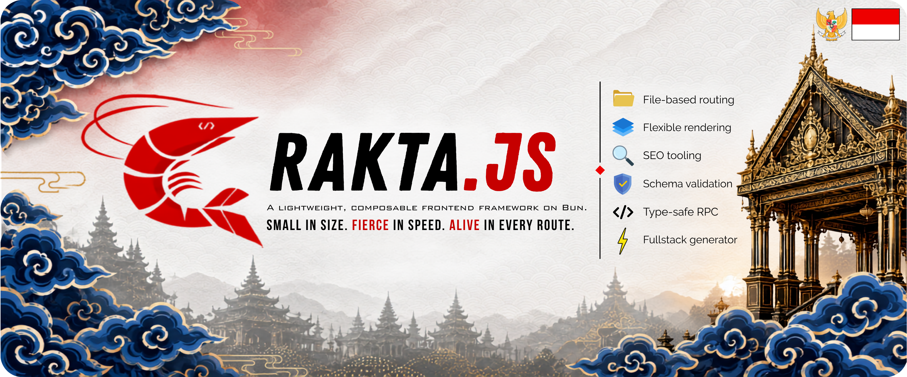

<p align="center">
  
</p>

<h1 align="center">Rakta.js | React Framework</h1>

<p align="center">
  <strong>A lightweight, composable frontend framework built on Bun, React, and TypeScript.</strong>
</p>

<p align="center">
  <em>Small in size. Fierce in speed. Alive in every route.</em>
</p>

<p align="center">
  <a href="https://github.com/RheinSullivan/raktajs/stargazers">
    
  </a>
  <a href="https://github.com/RheinSullivan/raktajs/graphs/contributors">
    
  </a>
  <a href="https://github.com/RheinSullivan/raktajs/commits/main">
    
  </a>
  <a href="https://github.com/RheinSullivan/raktajs/commits/main">
    
  </a>
  <a href="https://www.npmjs.com/package/raktajs">
    
  </a>
  <a href="https://www.npmjs.com/package/create-rakta-app">
    
  </a>
  <a href="https://www.npmjs.com/package/raktajs">
    
  </a>
  <a href="https://www.npmjs.com/package/create-rakta-app">
    
  </a>
  <a href="https://bun.sh">
    
  </a>
  <a href="https://react.dev">
    
  </a>
  <a href="https://www.typescriptlang.org">
    
  </a>
  <a href="https://go.dev">
    
  </a>
  <a href="https://www.ruby-lang.org">
    
  </a>
  <a href="./LICENCE">
    
  </a>
</p>

<p align="center">
  <strong>Bun in the engine. React at the core. Cirebon in the soul. Garuda in the heart.</strong>
</p>

---
<p align="center">
  Assalamu'alaikum Warahmatullahi Wabarakatuh · Shalom · Om Swastiastu · Namo Buddhaya · Wei De Dong Tian
  <br/>
  🇮🇩 Built with pride from Cirebon & South Jakarta, Indonesia. 🇵🇸 Free Palestine.
</p>

---

## Story & Vision

Rakta.js was created by **Muhammad Rizky Ramadhan**, a software developer from **Cirebon & South Jakarta, Indonesia**, known in the developer community as **Rhein Sullivan**, lead of **Vyagra Nexus™**.

The vision behind Rakta.js is simple: stop repeating the same setup across every project. Features like *file-based routing*, *auto-import with zero manual import statements*, *type-safe RPC*, an integrated *frontend-backend monolith* architecture, and *built-in authentication* are all available in one unified package - no fragmentation, no layered configuration, no fighting your tools.

Rakta.js does not aim to replace frameworks like Next.js, Nuxt, or Remix. It is a different take: **a framework that feels clean, fast, and has its own identity**, built by an Indonesian developer who wanted something simpler and more honest.

---

## About Rakta.js

Rakta.js is a lightweight, composable frontend framework built on React, Bun, and TypeScript. It provides file-based routing, flexible rendering modes (Client-Side Rendering, Server-Side Rendering, Static Site Generation, Single-Page Application, Hybrid), Search Engine Optimization tooling, Progressive Web App support, type-safe Remote Procedure Call, state management, schema validation, an HTTP client, and a project generator - all in one package.

The name **Rakta** comes from Sanskrit. It means red, life energy, courage, strength, identity, and movement. There is also a quiet reminder inside this name: when ordinary people carry heavy days in silence, every small tool should help them build something that truly belongs to them - not something that keeps them waiting at the gate.

The shrimp mascot represents Cirebon, a coastal city in West Java, Indonesia. Cirebon is known for its shrimp culture, the *Trusmi* batik craftsmanship, *Mega Mendung* cloud motifs, and its royal kraton heritage. Rakta.js uses this identity as a living foundation - not as decoration, but as a real part of who built it and why.

---

## The Origin

In the final year of an undergraduate degree, there was a thesis project to finish. A real one - with a deadline, a supervisor, chapters to write, and a working application to demonstrate.

The application itself was not complicated. But before writing a single line of business logic, there was a queue of setup tasks that had nothing to do with the actual problem: pick a framework, configure a bundler, set up routing from scratch, wire authentication manually, connect a backend, find a UI library, build a dashboard layout, import every single component by hand at the top of every file. Each of those steps was documented somewhere, each required decisions, and each consumed time that was supposed to go toward the actual work.

At some point it became clear that this overhead was not unique to that thesis. It happened every time a new project started. The same sequence, the same friction, the same feeling of building a house by first manufacturing your own bricks.

Rakta.js came out of that frustration. Not as a theory, not as a side project for fun - but as a direct response to a real experience of wasted time. The framework combines what should have always come together: file-based routing so there is nothing to configure, auto-import so components are available without writing import statements, a pre-wired authentication system, a backend scaffolded and ready on day one, and a project structure that reflects how applications actually get built rather than how tooling vendors prefer to sell their products.

It is not trying to compete with Next.js on feature count. It is trying to give back the hours that got spent on setup instead of building.

---

## Why Rakta.js?

Every problem in the table below is a real pain point that comes up when building modern web apps. This is how Rakta.js addresses each one.

| Problem | Rakta.js Approach |
| --- | --- |
| Frontend projects often start with too much setup | `create-rakta-app` generates a ready-to-run app in seconds |
| Routing setup becomes repetitive across every page | **MegaWeave** provides automatic file-based routing |
| Navigation and image elements feel too generic | **ShrimpStep** (`<click>`) and **TrusmiFrame** (`<picture>`) have Rakta.js identity |
| Search Engine Optimization always needs extra configuration | **MegaSignal** handles metadata, sitemap, robots, RSS, and JSON-LD |
| Progressive Web App is usually added as an afterthought | **ShrimpHarbor** is the built-in offline and installable app layer |
| Build tooling feels heavy | **CherbonsEngine** runs on Bun-powered tooling |
| Runtime strategy needs to stay flexible | **NorthCoastFlow** manages request flow and rendering strategy |
| Type-safe Remote Procedure Call usually needs a separate library | **NagaLimanWire** is the built-in type-safe Remote Procedure Call system |
| Projects need build and route diagnostics | **JatiLens** is the project health and diagnostics layer |
| Framework integrations need predictable lifecycle | **RaktaKernel** coordinates services, environment, and plugins |
| Apps need fine-grained request control | **RaktaMiddleware** supports before, after, redirect, rewrite, and abort |
| Documentation needs to stay Markdown-first | **RaktaDocs** generates sidebar, search index, and VitePress config |

---

## Get Started

### Installation

Create a new project with any supported package manager:

```bash
# Bun (recommended)
bun create rakta-app@latest my-app

# npm
npm create rakta-app@latest my-app

# pnpm
pnpm create rakta-app@latest my-app

# Yarn
yarn create rakta-app my-app

# Direct runners
bunx create-rakta-app@latest my-app
npx create-rakta-app@latest my-app

# Start development
cd my-app
bun run dev
```

Dependencies are installed automatically by `create-rakta-app`. If you use `--no-install`, run `bun install` once before `bun run dev`. The development server runs at `http://localhost:3000` by default.

---

### Project Modes

When you run `create-rakta-app`, you will be asked to choose between two project modes. Both are production-ready out of the box.

#### Frontend Only

Use this when you are building a Single-Page Application or a frontend-only site. No backend is generated. The project root itself is the app.

```bash
bun create rakta-app@latest my-frontend
# Select: Frontend only
```

Generated structure:

```txt
my-frontend/
├─ app/
│  ├─ page.tsx              # Main page
│  ├─ layout.tsx            # Global layout
│  ├─ components/           # Reusable UI components
│  ├─ hooks/                # Custom React hooks
│  ├─ lib/                  # Helpers, utilities, data
│  ├─ loading.tsx           # Loading UI
│  ├─ error.tsx             # Error UI
│  └─ notFound.tsx          # 404 page
│
├─ public/                  # Static assets
├─ styles/
│  └─ globals.css
│
├─ rakta-env.d.ts           # Auto Import type declarations
├─ rakta.config.ts          # Rakta.js configuration
├─ package.json
├─ postcss.config.ts
└─ tsconfig.json
```

#### Fullstack App (Powered by Gaman.js & Multi-Backend Adapters)

Use this when you need both a frontend and a backend in one monorepo. Fullstack Rakta.js defaults to **Gaman.js** - a lightweight, functional-first Bun server framework. You can also select alternative backend options such as **Laravel (PHP + MySQL)**, Nest.js, Express.js, Adonis.js, Flask, Prabogo (Go), Ruby on Rails, or Spring Boot 3.x.

```bash
bun create rakta-app@latest my-fullstack
# Select: Fullstack app
```

Generated structure:

```txt
my-fullstack/
├─ frontend/
│  ├─ app/
│  │  ├─ (root)/               # Public website routes
│  │  │  ├─ layout.tsx         # Layout with Header & Footer
│  │  │  └─ page.tsx
│  │  │
│  │  ├─ (auth)/               # Authentication pages
│  │  │  ├─ layout.tsx         # Layout without Header & Footer
│  │  │  ├─ login/
│  │  │  ├─ register/
│  │  │  ├─ forgot-password/
│  │  │  └─ reset-password/
│  │  │
│  │  ├─ (dashboard)/          # Protected pages
│  │  │  ├─ layout.tsx
│  │  │  └─ dashboard/
│  │  │
│  │  ├─ components/           # Reusable UI components
│  │  ├─ hooks/                # Custom React hooks
│  │  ├─ lib/                  # Helpers & utilities
│  │  ├─ loading.tsx
│  │  ├─ error.tsx
│  │  └─ notFound.tsx
│  │
│  ├─ public/
│  ├─ styles/
│  ├─ rakta-env.d.ts
│  └─ rakta.config.ts
│
├─ backend/
│  ├─ src/
│  │  ├─ index.ts              # Entry point
│  │  ├─ console/              # Custom CLI commands
│  │  ├─ database/             # Client, migrations, seeders
│  │  └─ modules/              # App and feature modules
│  └─ package.json
│
├─ shared/                     # Shared types and contracts
├─ docs/
├─ package.json
└─ tsconfig.base.json
```

---

## Documentation

All detailed guides, API references, backend integrations, database integrations, framework elements, architecture, and roadmap are in the `docs/` folder.

- [Getting Started](./docs/en/gettingStarted.md)
- [API Reference](./docs/en/apiReference.md)
- [Framework Elements](./docs/en/elements.md)
- [Backend Integrations](./docs/en/backendFrameworks.md)
- [Database Integrations](./docs/en/database/README.md)
- [Data Seeders for Testing](./docs/en/dataSeeders.md)
- [Architecture](./docs/en/architecture.md)
- [Roadmap](./docs/en/roadmap.md)
- [Migration Guide](./docs/en/migrationGuide.md)

**Supported backends:** Gaman.js, Nest.js, Express.js, Adonis.js, Hono.js, Laravel, CodeIgniter 4, Flask, Django, Prabogo, Beego v2, Ruby on Rails, Hanami 2.x, Spring Boot 3.x, and Jakarta EE 10 / J2EE.

**Supported databases:** SawitDB, Oracle Database, PostgreSQL, MySQL, SQLite, MongoDB, Firebase, MariaDB, Redis, PlanetScale, Neon, and Turso.

---

## Framework Elements

Rakta.js ships 10 built-in JSX elements that carry framework-level behavior at runtime:

`<click>`, `<picture>`, `<lazy>`, `<guard>`, `<seal>`, `<shelf>`, `<island>`, `<prefetch>`, `<route>`, and `<resource>`.

Four additional compatibility elements - `<pantura>`, `<reborns>`, `<form>`, and `<title>` - remain fully supported but are not part of the core set.

See [Framework Elements](./docs/en/elements.md) for props, runtime behavior, and examples.

---

## Roadmap

| Priority | Focus |
| --- | --- |
| Core | Kernel, lifecycle, Dependency Injection, plugin registry |
| Middleware | Global, route, layout, API, edge middleware |
| Layout | Nested, persistent, loading, error, not-found layouts |
| Data | Streaming, defer, cache, revalidate, Incremental Static Regeneration |
| Deployment | Node, Bun, Deno, Cloudflare, Vercel, Netlify, Docker |
| Developer Experience | Hot Module Replacement, error overlay, bundle analyzer, devtools, type generator |

---

## All Contributors

<a href="https://github.com/RheinSullivan/raktajs/graphs/contributors">
  
</a>

---

## Contributing

New contributors are welcome! Check out our [Contributing Guide](CONTRIBUTING.md) for help getting started.

Contributions are welcome. Please ensure your changes remain focused, typed, tested, and aligned with Rakta.js core principles: performance, simplicity, Developer Experience, tree shaking, edge runtime compatibility, and production readiness. See [CONTRIBUTING.md](CONTRIBUTING.md).

---

## Donations & Humanitarian Support

Rakta.js accepts public donations with 100% financial transparency. Minimum 70% of all funds are allocated to humanitarian aid (Palestine 🇵🇸 relief, orphanages, low-income families, elderly care, disaster relief) and up to 30% for framework operations (server, CDN, domain).

<p align="center">
  <a href="https://buymeacoffee.com/rheinsullivan" target="_blank">
    
  </a>
</p>

See detailed transparency reports in [docs/en/donations.md](docs/en/donations.md).

---

## Author

Built by **Muhammad Rizky Ramadhan**, also known as **Rhein Sullivan**, from **Cirebon & South Jakarta, Indonesia**.

---

## License

MIT - Rakta.js | Vyagra Nexus™ ❤️ 🇮🇩 Indonesia & 🇵🇸 Palestine

[LICENCE](./LICENCE)
