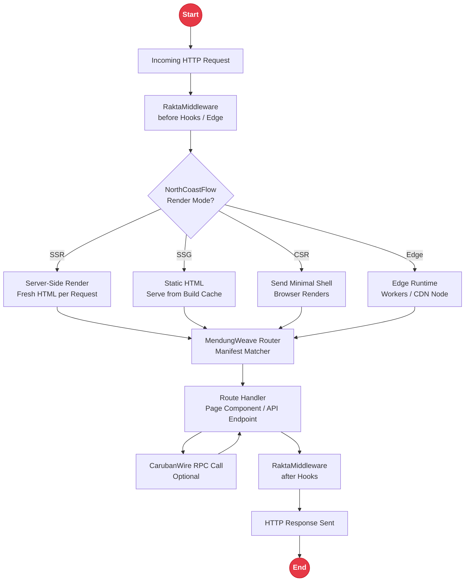
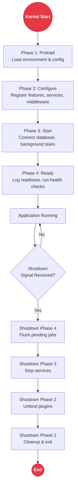

# Rakta.js Architecture

This document explains how the framework is structured internally. If you want to contribute, build plugins, or understand how requests flow through the system, this is the right starting point.

---

## Request Pipeline Overview

Rakta.js is a modular framework organized around a central kernel. Each module has a single responsibility and can be imported independently. The build system tree-shakes everything you don't import.



---

## RaktaKernel - Dependency Injection Container

The kernel is the foundation. It manages services, environments, plugins, and the startup/shutdown lifecycle.

```typescript
import { createRaktaKernel } from "rakta/kernel";

const kernel = createRaktaKernel({
  environmentName: "production",
  env: {
    DATABASE_URL: process.env.DATABASE_URL,
    AUTH_SECRET: process.env.AUTH_SECRET,
  },
});

// Register a service as a singleton
kernel.services.singleton("db", () => connectDatabase(
  kernel.environment.require("DATABASE_URL")
));

// Register a plugin
kernel.use({
  name: "my-plugin",
  async configure(context) {
    context.registerFeature({ name: "my-feature", enabled: true });
  },
  async ready() {
    console.log("Plugin ready.");
  },
});

await kernel.start(); // run all lifecycle phases
```

### Plugin Lifecycle & Startup Pipeline



| Phase | When | Purpose |
|-------|------|---------|
| `configure` | Kernel start | Register features, services, middleware |
| `start` | After all plugins configured | Connect to database, start background tasks |
| `ready` | Application fully ready | Log readiness, run health checks |
| `shutdown` | Application shutting down | Cleanup connections, flush queues |

### Module Loader

`createModuleLoader()` lazy-loads plugins from dynamic importers with error isolation:

```typescript
const loader = createModuleLoader();
const modules = await loader.loadMany([
  () => import("./plugins/analytics"),
  () => import("./plugins/auth"),
]);
```

---

## RaktaMiddleware - Request Pipeline

Middleware runs before and after route handlers. All middleware is async-first.

```typescript
import { defineMiddleware, compose } from "rakta/middleware";

const authMiddleware = defineMiddleware({
  name: "auth",
  async before({ request, next, redirect, abort }) {
    const token = request.headers.get("Authorization");
    if (!token) return redirect("/login");
    const user = await verifyToken(token);
    if (!user) return abort(401, "Unauthorized");
    return next({ user });
  },
});
```

### Middleware Scopes

| Scope | Execution Point |
|-------|-----------------|
| `global` | Every request |
| `route` | Specific route pattern |
| `api` | API endpoints only |
| `layout` | Layout boundaries |
| `edge` | Edge runtime only |

---

## NagaLimanWire - Type-Safe RPC

End-to-end type safety across the network boundary.

```typescript
// Server
const appRouter = createRaktaRouter({
  getUser: publicProcedure
    .input(object({ id: string() }))
    .query(async ({ input }) => db.users.findById(input.id)),
});

// Client
const api = createRaktaClient<typeof appRouter>({ baseUrl: "/rpc" });
const user = await api.getUser.query({ id: "123" }); // fully typed
```

---

## CherbonsEngine - Build Engine

Powered by Bun + esbuild. Manages the dev server, production build, and subpath module exports.

---

*Rakta.js - Built by Rhein Sullivan (Muhammad Rizky Ramadhan) from Cirebon & South Jakarta, Indonesia. Vyagra Nexus. Free Palestine.*
