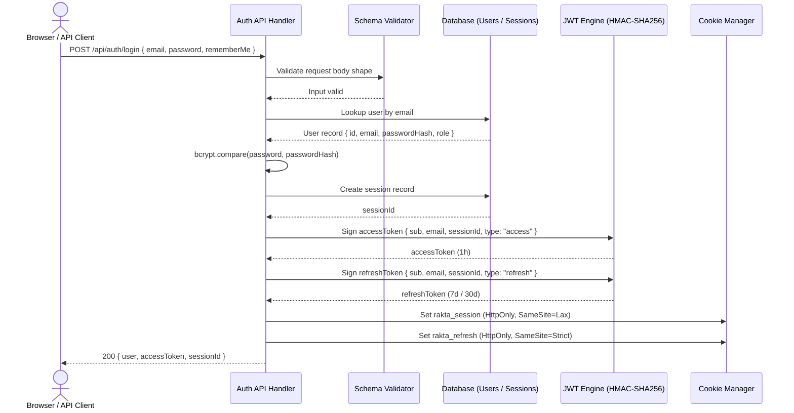
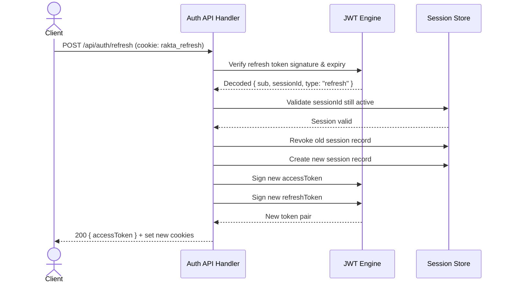

# Authentication

Self-hosted authentication generated by Rakta.js fullstack generator. No Clerk, NextAuth, Supabase, or Firebase.

---

## JWT + Session Authentication Architecture



---

## Refresh Token Rotation Flow



---

## Authentication Strategies

When generating a fullstack project, choose from:

| Strategy | Description |
|---|---|
| **None** | No authentication generated |
| **JWT** | Stateless access + refresh token pair |
| **Session** | Server-side session with cookie |
| **JWT + Session** | Both strategies simultaneously |

---

## Generated Endpoints

| Endpoint | Method | Auth Required | Description |
|---|---|---|---|
| `/api/auth/register` | POST | No | Create account |
| `/api/auth/login` | POST | No | Returns `accessToken` + sets cookies |
| `/api/auth/refresh` | POST | No (refresh token) | Rotate token pair |
| `/api/auth/me` | GET | Yes | Current user |
| `/api/auth/logout` | POST | Yes | Revoke current session |
| `/api/auth/logout-all` | POST | Yes | Revoke all sessions |
| `/api/auth/forgot-password` | POST | No | Request OTP |
| `/api/auth/reset-password` | POST | No | Reset with OTP |

---

## Login

```bash
curl -X POST http://localhost:4000/api/auth/login \
  -H "Content-Type: application/json" \
  -d '{
    "email": "admin@example.com",
    "password": "your-password",
    "rememberMe": true
  }'
```

Response:

```json
{
  "success": true,
  "data": {
    "user": { "id": "...", "email": "admin@example.com", "role": "ADMIN" },
    "accessToken": "<short-lived JWT>",
    "sessionId": "<session-id>"
  }
}
```

Two cookies are set automatically:
- `rakta_session` - session ID (HttpOnly, SameSite=Lax)
- `rakta_refresh` - refresh token (HttpOnly, SameSite=Strict)

---

## Using the Access Token

```bash
# Bearer token (API client)
curl http://localhost:4000/api/auth/me \
  -H "Authorization: Bearer <accessToken>"

# Cookie (browser - automatic after login)
curl http://localhost:4000/api/auth/me --cookie "rakta_session=<sessionId>"
```

---

## Protecting Routes

```ts
import { requireAuth, requireRole, optionalAuth } from "../middlewares/auth.middleware";

// Require a logged-in user
const rejected = await requireAuth(request);
if (rejected) return rejected;

// Require a specific role
const rejected = await requireRole(request, "ADMIN");
if (rejected) return rejected;

// Optional - get user if logged in
const user = await optionalAuth(request);
```

---

## Session Policy

| Policy | SESSION_MODE | Behavior |
|---|---|---|
| Multiple Sessions | `multiple` | Default - logins from multiple devices allowed |
| Single Session | `single` | New login revokes all previous sessions |

---

## Token Security

- JWT signed with HMAC-SHA256 using `AUTH_SECRET`
- Access token payload: `{ sub, email, sessionId, type: "access", exp }`
- Refresh token payload: `{ sub, email, sessionId, type: "refresh", exp }`
- Tokens with `type: "refresh"` are rejected by `authenticate()`

---

## Environment Variables

```env
AUTH_SECRET=replace-with-random-32-char-secret
SESSION_MODE=multiple
AUTH_STRATEGY=jwt
CORS_ORIGIN=http://localhost:3000
```

---

## OAuth Providers (Optional)

When generating a project, you can optionally select OAuth providers (Google, GitHub, Apple, etc.). This extends Rakta.js authentication - it does not replace it.

OAuth configuration is done manually - no third-party auth platform is used.

---

## Related

- [Migration Guide](./migrationGuide.md)
- [Performance](./performance.md)
- [Dev Tools](./devtools.md)
