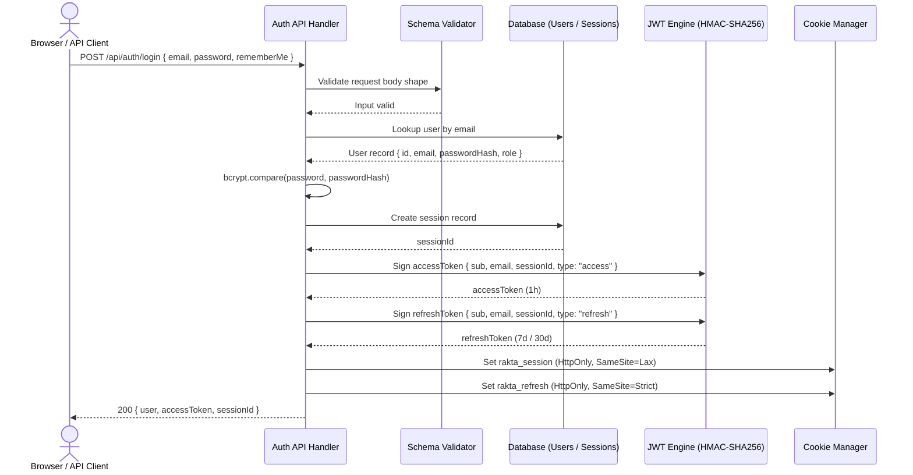
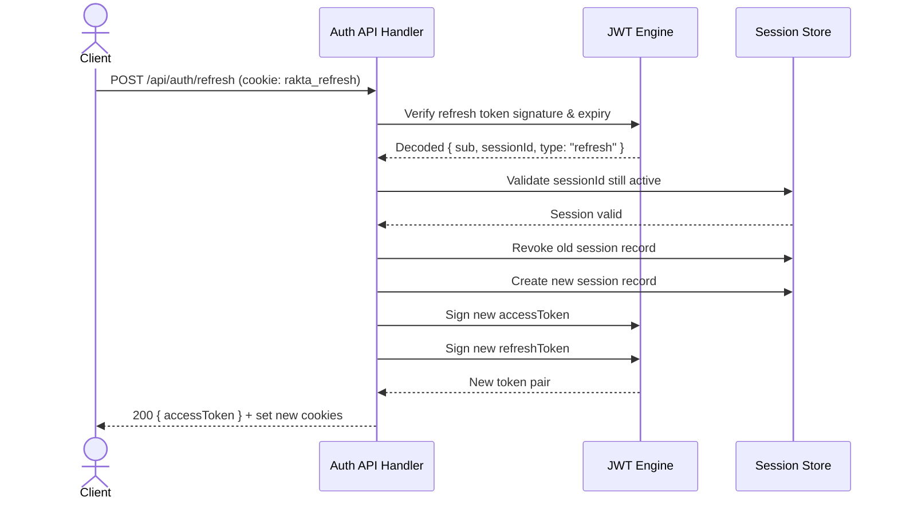

# Authentication

Self-hosted authentication generated by Rakta.js fullstack generator. No Clerk, NextAuth, Supabase, or Firebase.

---

## JWT + Session Authentication Architecture



---

## Refresh Token Rotation Flow



---

## Authentication Strategies

When generating a fullstack project, choose from:

| Strategy | Description |
|---|---|
| **None** | No authentication generated |
| **JWT** | Stateless access + refresh token pair |
| **Session** | Server-side session with cookie |
| **JWT + Session** | Both strategies simultaneously |

---

## Generated Endpoints

| Endpoint | Method | Auth Required | Description |
|---|---|---|---|
| `/api/auth/register` | POST | No | Create account |
| `/api/auth/login` | POST | No | Returns `accessToken` + sets cookies |
| `/api/auth/refresh` | POST | No (refresh token) | Rotate token pair |
| `/api/auth/me` | GET | Yes | Current user |
| `/api/auth/logout` | POST | Yes | Revoke current session |
| `/api/auth/logout-all` | POST | Yes | Revoke all sessions |
| `/api/auth/forgot-password` | POST | No | Request OTP |
| `/api/auth/reset-password` | POST | No | Reset with OTP |
| `/api/auth/oauth/:provider/login` | GET | No | Start sign-in through a selected provider |
| `/api/auth/oauth/:provider/callback` | GET | No | Provider callback, returns to the frontend |

---

## Login

```bash
curl -X POST http://localhost:4000/api/auth/login \
  -H "Content-Type: application/json" \
  -d '{
    "email": "admin@example.com",
    "password": "your-password",
    "rememberMe": true
  }'
```

Response:

```json
{
  "success": true,
  "data": {
    "user": { "id": "...", "email": "admin@example.com", "role": "ADMIN" },
    "accessToken": "<short-lived JWT>",
    "sessionId": "<session-id>"
  }
}
```

Two cookies are set automatically:
- `rakta_session` - session ID (HttpOnly, SameSite=Lax)
- `rakta_refresh` - refresh token (HttpOnly, SameSite=Strict)

---

## Using the Access Token

```bash
# Bearer token (API client)
curl http://localhost:4000/api/auth/me \
  -H "Authorization: Bearer <accessToken>"

# Cookie (browser - automatic after login)
curl http://localhost:4000/api/auth/me --cookie "rakta_session=<sessionId>"
```

---

## Protecting Routes

```ts
import { requireAuth, requireRole, optionalAuth } from "../middlewares/auth.middleware";

// Require a logged-in user
const rejected = await requireAuth(request);
if (rejected) return rejected;

// Require a specific role
const rejected = await requireRole(request, "ADMIN");
if (rejected) return rejected;

// Optional - get user if logged in
const user = await optionalAuth(request);
```

---

## Session Policy

| Policy | SESSION_MODE | Behavior |
|---|---|---|
| Multiple Sessions | `multiple` | Default - logins from multiple devices allowed |
| Single Session | `single` | New login revokes all previous sessions |

---

## Token Security

- JWT signed with HMAC-SHA256 using `AUTH_SECRET`
- Access token payload: `{ sub, email, sessionId, type: "access", exp }`
- Refresh token payload: `{ sub, email, sessionId, type: "refresh", exp }`
- Tokens with `type: "refresh"` are rejected by `authenticate()`

---

## Environment Variables

```env
AUTH_SECRET=replace-with-random-32-char-secret
SESSION_MODE=multiple
AUTH_STRATEGY=jwt
CORS_ORIGIN=http://localhost:3000
OAUTH_REDIRECT_BASE_URL=http://localhost:4000
```

---

## OAuth Providers (Optional)

When generating a fullstack project you can select one or more OAuth providers, or leave them out completely. Choosing none skips every OAuth route and hides the provider buttons on the sign-in page. Whatever you pick is wired into three places:

- **Backend routes** — every supported backend (Gaman.js, Nest.js, Express, Adonis, Hono, Laravel, CodeIgniter, Flask, Django, Prabogo, Beego, Rails, Hanami, Spring Boot, Jakarta EE) generates an authorization and a callback route per selected provider, for example `/api/auth/oauth/google/login` and `/api/auth/oauth/google/callback`.
- **Environment variables** — each backend's `.env.example` lists the provider variables directly instead of generic placeholders (`GOOGLE_CLIENT_ID`, `GOOGLE_CLIENT_SECRET`, `GOOGLE_REDIRECT_URI`, and the matching set for the others). `OAUTH_REDIRECT_BASE_URL` is the default callback base when a provider-specific redirect URI is not set.
- **Sign-in page** — the fullstack template renders one button per selected provider (brand icon plus name) under the email and password form. The buttons only appear for providers you chose during generation.

Seven providers are built in: Google, GitHub, Apple, Microsoft, Discord, GitLab, and Facebook. You can also pick **custom**, which keeps the flow identical but leaves the authorize and token URLs for you to fill in.

Configuration stays manual. Rakta.js never depends on a third-party auth platform. You create the application on the provider's side, copy the client ID and secret into your environment, and register the callback URL against your app.

---

## Related

- [Migration Guide](./migrationGuide.md)
- [Performance](./performance.md)
- [Dev Tools](./devtools.md)
