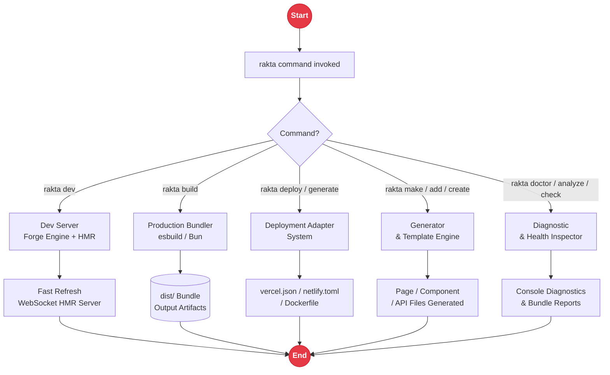

# Rakta CLI Tooling

The `rakta` command is the primary control surface of the framework for local development, scaffolding, diagnostics, build inspection, deployment setup, and project maintenance.

---

## CLI Workflow Architecture



---

## Core Commands

| Command | Purpose |
| --- | --- |
| `rakta dev` | Launches development server with Fast Refresh & HMR |
| `rakta build` | Compiles application for production |
| `rakta build --analyze` | Compiles application and prints Forge bundle analysis |
| `rakta start` | Runs production server |
| `rakta routes` | Prints file-based route manifest |
| `rakta doctor` | Diagnostic health checker for project & environment |
| `rakta analyze` | Inspects build output and route rendering modes |
| `rakta benchmark` | Runs local benchmark suite |
| `rakta upgrade [version]` | Bumps Rakta.js dependencies in `package.json` |
| `rakta check` | Runs typecheck and lint scripts |
| `rakta lint` | Runs Biome code checks |
| `rakta format` | Formats codebase with Biome |

---

## Generators

```bash
rakta create page dashboard
rakta add component Button
rakta make:api users
rakta generate deployment vercel
```

`create` and `add` are aliases for `make:*` generators. Deployment generators write native target configuration files such as `vercel.json`, `netlify.toml`, `wrangler.toml`, or `Dockerfile`.

---

## Plugins and Telemetry

```bash
rakta plugin list
rakta plugin create analytics
rakta telemetry on
rakta telemetry off
```

---

## Related Documentation

- [`deployment.md`](./deployment.md)
- [`kernel.md`](./kernel.md)
- [`autoImport.md`](./autoImport.md)
