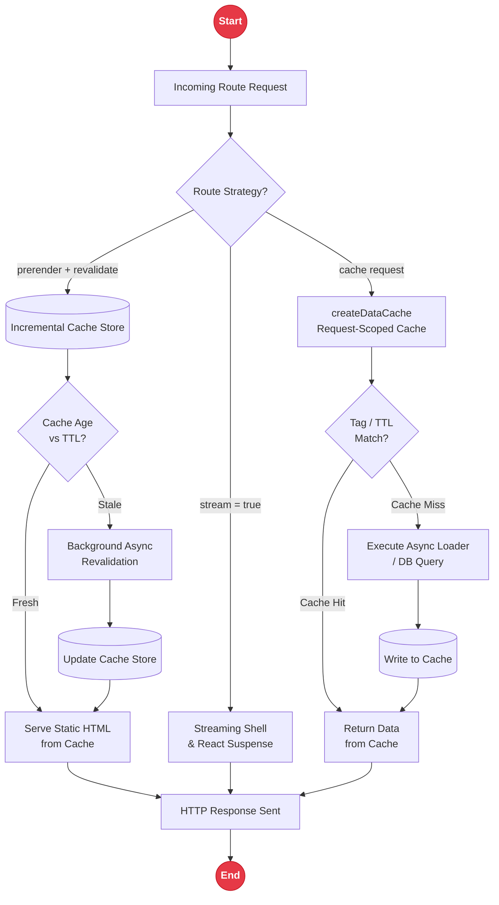

# Data Fetching and Caching

The `rakta/data` module supplies lightweight data caching utilities, route data strategy contracts, and helper functions for identifying ISR, streaming, and prefetching capabilities. These primitives are consumed by the Forge build engine, Tide runtime, and custom renderers to determine how each route is fetched, cached, and revalidated.

---

## Data Fetching & Caching Lifecycle Architecture



---

## Data Cache API

`createDataCache()` returns a request-scoped cache instance. Entries are stored with string keys and can be invalidated by tags or individual keys.

```ts
import { createDataCache } from "raktajs/data";

const cache = createDataCache();

// Cache loader response for 60 seconds with "cms" tag
const posts = await cache.cache("cms:posts", () => fetchPostsFromDB(), {
  ttl: 60_000,
  tags: ["cms"],
});

// Invalidate all entries tagged "cms"
cache.revalidate("cms");

// Invalidate a single key
cache.revalidate("cms:posts");
```

### Cache Options

| Option | Type | Default | Description |
| --- | --- | --- | --- |
| `ttl` | `number` | `0` (never expires) | Expiration time in milliseconds |
| `tags` | `string[]` | `[]` | Tag list for group invalidation |

---

## Route Data Strategy

`defineRouteDataStrategy` annotates routes with their rendering strategy and data contract:

```ts
import { defineRouteDataStrategy, isIncrementalRoute, shouldStreamRoute, shouldPrefetchRoute } from "raktajs/data";

const dashboardStrategy = defineRouteDataStrategy({
  routePattern: "/dashboard",
  runtime: "server",    // "server" | "client" | "edge"
  prerender: false,      // true = SSG / ISR during build
  stream: true,          // true = enable streaming response
  prefetch: true,        // true = prefetch on hover
  revalidate: 60,        // ISR revalidation interval in seconds
});

const blogStrategy = defineRouteDataStrategy({
  routePattern: "/blog/:slug",
  runtime: "server",
  prerender: true,       // pre-render during build
  stream: false,
  prefetch: true,
  revalidate: 3600,      // rebuild hourly
});

// Helper Checks
isIncrementalRoute(dashboardStrategy); // false
isIncrementalRoute(blogStrategy);      // true
shouldStreamRoute(dashboardStrategy);  // true
shouldPrefetchRoute(dashboardStrategy); // true
```

---

## Related Documentation

- [`routing.md`](./routing.md) - File-based routing
- [`layout.md`](./layout.md) - Layout system
- [`rpc.md`](./rpc.md) - Type-safe RPC API
