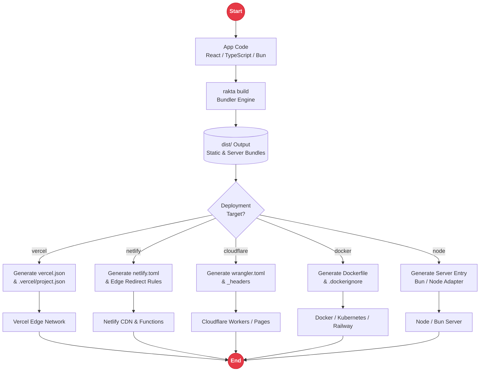

# Deployment & Target Adapters

Rakta.js projects are powered by Bun and can be deployed as static frontends, Bun servers, Docker containers, or serverless/edge platforms for Vercel, Netlify, Cloudflare Workers/Pages, AWS Lambda, Railway, and Fly.io.

---

## Deployment Pipeline Architecture



---

## CLI Generator Commands

```bash
rakta generate deployment vercel
rakta generate deployment netlify
rakta generate deployment cloudflare-workers
rakta generate deployment docker
```

Generated target specs are concise and adhere strictly to the target provider formats. The Vercel adapter emits `vercel.json` and `.vercel/project.json`, Netlify emits `netlify.toml`, Cloudflare emits `wrangler.toml`, and Docker emits `Dockerfile` plus `.dockerignore`.

---

## Deployment Adapter API

Use the programmatic API when plugins, templates, or internal tools need to generate target configuration files without running the CLI:

```ts
import { createDeploymentAdapter } from "raktajs/deployment";

const adapter = createDeploymentAdapter("vercel", {
  appName: "my-rakta-app",
  outDir: "dist",
});

for (const file of adapter.files) {
  console.log(file.path, file.content);
}
```

### Supported Targets

| Target | Runtime |
| --- | --- |
| `node` | Node-compatible Server |
| `bun` | Native Bun Server |
| `deno` | Deno Server |
| `cloudflare-workers` | Edge worker |
| `cloudflare-pages` | Static edge hosting |
| `netlify` | Static or edge hosting |
| `vercel` | Static or edge hosting |
| `docker` | Containerized Bun app |
| `aws-lambda` | Serverless function |
| `fly` | Bun/Node service |
| `railway` | Bun/Node service |
| `render` | Bun/Node service |
| `firebase` | Static hosting |
| `github-pages` | Static hosting |
| `static` | Generic static export |

---

## Environment Variables

| Variable | Purpose |
| --- | --- |
| `PORT` | Backend server port |
| `CORS_ORIGIN` | Allowed origin header for API requests |
| `DATABASE_URL` | Database connection string |
| `AUTH_SECRET` | Secret key for JWT signing (minimum 32 characters) |
| `SESSION_MODE` | Session behavior: `single` or `multi` |

---

## Related Documentation

- [`templates.md`](./templates.md)
- [`kernel.md`](./kernel.md)
- [`middleware.md`](./middleware.md)
- [`docsSystem.md`](./docsSystem.md)
