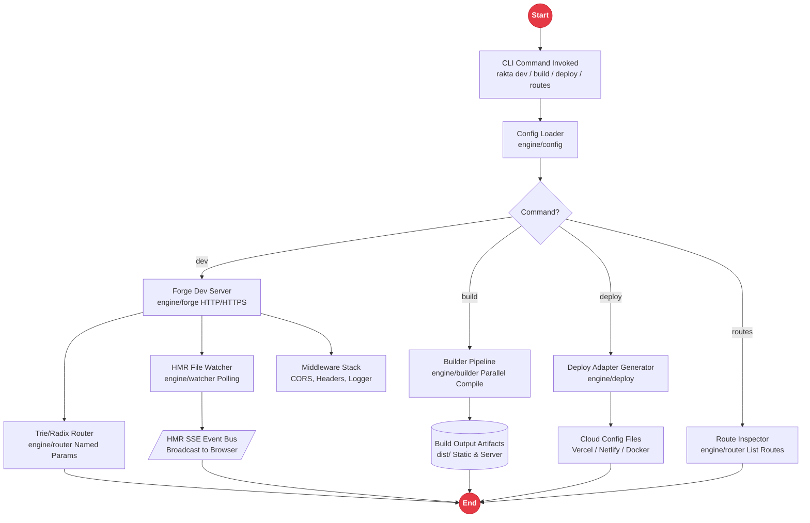

# Rakta Engine (Golang Native Tooling)

Rakta Engine is a high-performance native Golang core powering the dev server, build pipeline, HMR file watcher, native router, and deployment adapters for Rakta.js.

---

## Golang Engine Architecture



---

## Engine Components

1. **Rakta Forge (`engine/forge`)**: High-speed HTTP/HTTPS dev server with SSE HMR bridge and reverse proxy capability.
2. **Rakta Router (`engine/router`)**: Native Radix Trie HTTP router supporting named parameters (`:id`), catch-all (`*`), and middleware chains.
3. **Rakta Watcher (`engine/watcher`)**: Polling-based file system watcher with incremental modification detection for HMR.
4. **Rakta Builder (`engine/builder`)**: Parallel compilation pipeline, dependency graph scanner, and persistent hashing cache.
5. **Rakta Middleware (`engine/middleware`)**: Native request middleware stack supplying CORS, Secure Headers, and Logger functions.
6. **Rakta Config (`engine/config`)**: Structured JSON/TS configuration loader with typed environment variable fallbacks.
7. **Rakta Deploy (`engine/deploy`)**: Automated cloud deployment spec generator for Vercel, Netlify, Cloudflare Workers/Pages, Railway, and Docker.

---

## Native Binary Compilation

Compile cross-platform native Golang binaries:

```bash
cd engine
go build -o rakta ./cmd/cli
```
