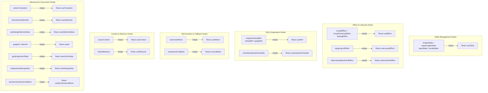

# Rakta Hooks - Cultural Heritage Signature Naming

## Overview

Rakta Hooks draw inspiration from Cirebon's rich culture, cuisine, and history (including Sega Lengko, Empal Gentong, Batik Megamendung, Keraton Kasepuhan, Keraton Kanoman, Sunan Gunung Jati, Tarling Music, Sintren Dance, etc.).

These hooks provide expressive, culturally rich aliases when Auto Import is turned off while avoiding standard generic naming.

---

## Hook Categories & React Equivalents



---

## Quick Start

```tsx
import { empalEffect, lengkoState, megamendungRef } from "raktajs/hooks";

export default function Counter() {
  const [count, setCount] = lengkoState(0);
  const buttonRef = megamendungRef<HTMLButtonElement>(null);

  empalEffect(() => {
    buttonRef.current?.focus();
  }, []);

  return (
    <button ref={buttonRef} onClick={() => setCount(count + 1)}>
      {count}
    </button>
  );
}
```

---

## API Reference & Cultural Heritage Names

| Rakta Hook Name | Cultural Signature / Heritage Origin | React Equivalent |
| --- | --- | --- |
| `lengkoState` / `segaLengkoState` | Sega Lengko (Iconic Culinary) | `useState` |
| `jawaState` / `sundaState` | Javanese & Sundanese Cultural Dualism | `useState` |
| `empalEffect` / `empalGentongEffect` | Empal Gentong (Iconic Culinary) | `useEffect` |
| `topengEffect` | Mask Dance (Tari Topeng) | `useEffect` |
| `megamendungRef` | Batik Megamendung (Iconic Cloud Motif) | `useRef` |
| `tarlingRef` / `grageRef` | Tarling Music / Grage | `useRef` |
| `kanomanMemo` | Kanoman Palace (Keraton Kanoman) | `useMemo` |
| `kasepuhanCallback` | Kasepuhan Palace (Keraton Kasepuhan) | `useCallback` |
| `sunanContext` | Sunan Gunung Jati (Historical Legacy) | `useContext` |
| `tarlingReducer` | Tarling Folk Music | `useReducer` |
| `sintrenTransition` | Sintren Traditional Dance | `useTransition` |
| `tahuGejrotOptimistic` | Tahu Gejrot (Culinary Signature) | `useOptimistic` |
| `grageId` / `rebonId` | Grage / Rebon | `useId` |
| `tajugLayoutEffect` | Tajug Architecture (Sang Cipta Rasa) | `useLayoutEffect` |
| `genjringActionState` | Genjring Performative Arts | `useActionState` |
| `kejawananDebugValue` | Kejawanan Maritime Harbor | `useDebugValue` |
| `jamblangDeferredValue` | Nasi Jamblang Culinary | `useDeferredValue` |
| `muludanImperativeHandle` | Muludan Heritage Festival | `useImperativeHandle` |
| `batuLawangInsertionEffect` | Batu Lawang Landmark | `useInsertionEffect` |
| `plumbonSyncExternalStore` | Plumbon Crafts Center | `useSyncExternalStore` |

---

## Generator Behavior

When using `create-rakta-app`, if Auto Import is disabled (`autoImport: false`), the generated project starter automatically imports hooks using cultural signature naming (`lengkoState`, `empalEffect`, `megamendungRef`, etc.) from `raktajs/hooks`.

---

## Related Documents

- [Auto Import](./autoImport.md)
- [Framework Core](./kernel.md)
