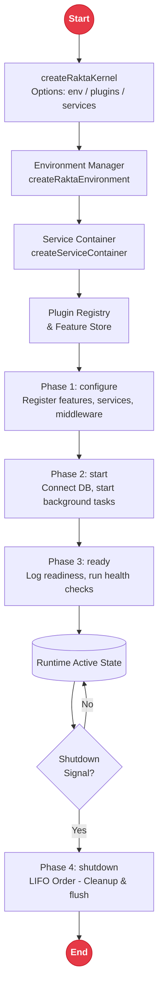

# Kernel and Plugin System

The Rakta.js kernel is the production foundation for framework services, environment resolution, feature registration, and plugin lifecycles. It is available via `rakta/kernel` and exported directly from `raktajs`.

---

## Kernel & Service Container Architecture



---

## Layer Architecture

| Layer | Responsibility |
| --- | --- |
| Service container | Register values and factory functions with singleton or transient lifetimes |
| Environment | Read `RAKTA_ENV`, `NODE_ENV`, and explicit environment records |
| Feature registry | Assist plugins in announcing framework capabilities |
| Lifecycle plugin | Execute `configure`, `start`, `ready`, and `shutdown` hooks |

---

## Quick Start

```ts
import { createRaktaKernel } from "rakta/kernel";

const kernel = createRaktaKernel({
  environmentName: "production",
  env: {
    API_URL: "https://api.example.com",
  },
});

kernel.services.singleton("apiUrl", () =>
  kernel.environment.require("API_URL")
);

await kernel.start();

const apiUrl = await kernel.services.resolve<string>("apiUrl");
```

---

## Plugin System

Plugins are plain TypeScript objects that register services, expose features, and handle startup or shutdown routines.

```ts
import type { RaktaPlugin } from "rakta/kernel";

export const authPlugin: RaktaPlugin = {
  name: "auth",
  configure(context) {
    context.registerFeature({
      name: "auth",
      options: {
        strategy: "session",
      },
    });
  },
  start(context) {
    context.services.value("auth.ready", true);
  },
};
```

---

## API Reference

| API | Description |
| --- | --- |
| `createRaktaKernel(options)` | Creates a kernel with services, environments, plugins, and features |
| `createServiceContainer()` | Creates a standalone type-safe service container |
| `createRaktaEnvironment(name, env)` | Creates a standalone environment reader |
| `kernel.use(plugin)` | Registers a plugin prior to startup |
| `kernel.start()` | Executes `configure`, `start`, then `ready` hooks |
| `kernel.shutdown()` | Executes shutdown hooks in reverse plugin order |
| `kernel.snapshot()` | Returns read-only runtime diagnostics |
| `services.singleton(key, factory)` | Registers a cached singleton service factory |
| `services.value(key, value)` | Registers a static value service |
| `services.resolve(key)` | Resolves a service or throws a clear error |
| `services.tryResolve(key)` | Resolves a service or returns `undefined` |

---

## Related Documentation

- [`gettingStarted.md`](./gettingStarted.md)
- [`templates.md`](./templates.md)
- [`autoImport.md`](./autoImport.md)
- [`routing.md`](./routing.md)
