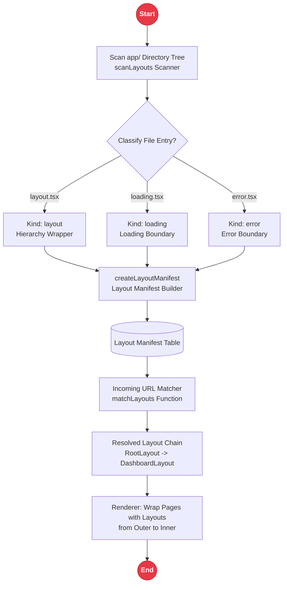
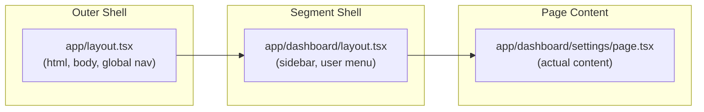

# Layout System

Rakta.js uses a file-based layout system similar to the `app/` directory convention. Layouts wrap pages and persist across navigations within the same URL segment tree. The `rakta/layout` module provides the scanner, manifest builder, and matcher used by the Forge build engine and any custom tooling.

---

## Layout System Architecture



---

## Nested Layout Chain



---

## When to Use This

Use layouts when you need shared UI - navigation bars, sidebars, footers, or authentication guards - that should remain mounted across route transitions within a section of your app.

---

## File Conventions

| File | Purpose |
| --- | --- |
| `app/layout.tsx` | Root layout - wraps every page in the app |
| `app/dashboard/layout.tsx` | Nested layout - wraps every page under `/dashboard` |
| `app/dashboard/loading.tsx` | Loading skeleton shown while the route segment loads |
| `app/dashboard/error.tsx` | Error boundary for the dashboard segment |
| `app/(auth)/layout.tsx` | Route group layout - does not add a URL segment |
| `app/dashboard/@analytics/layout.tsx` | Parallel slot - renders alongside the main content |

---

## Root Layout

Every Rakta.js app must have a root layout at `app/layout.tsx`. It is responsible for the `<html>` and `<body>` tags:

```tsx
// app/layout.tsx
interface RootLayoutProps {
  readonly children: React.ReactNode;
}

export default function RootLayout({ children }: RootLayoutProps) {
  return (
    <html lang="en">
      <body>{children}</body>
    </html>
  );
}
```

---

## Nested Layouts

Create a `layout.tsx` inside any segment folder to wrap routes under it:

```txt
app/
├─ layout.tsx           root layout (wraps all)
├─ page.tsx             /
├─ dashboard/
│  ├─ layout.tsx        dashboard layout (sidebar, user menu)
│  ├─ page.tsx          /dashboard
│  ├─ settings/
│  │  └─ page.tsx       /dashboard/settings
│  └─ analytics/
│     └─ page.tsx       /dashboard/analytics
└─ (auth)/
   ├─ layout.tsx        auth layout (no sidebar, centered form)
   ├─ login/page.tsx    /login
   └─ register/page.tsx /register
```

The layout chain for `/dashboard/settings` is: `app/layout.tsx` then `app/dashboard/layout.tsx`.

---

## Route Groups for Layout Isolation

Wrap folder names in parentheses - `(auth)` - to group routes under a shared layout without adding a URL segment. The parentheses are ignored in URLs:

```tsx
// app/(auth)/layout.tsx - applies to /login, /register, /forgot-password
export default function AuthLayout({ children }: { children: React.ReactNode }) {
  return (
    <main className="auth-shell">
      <div className="auth-card">{children}</div>
    </main>
  );
}
```

---

## Layout API (`rakta/layout`)

```ts
import { createLayoutManifest, matchLayouts } from "raktajs/layout";
import type { RaktaLayoutManifest, RaktaLayoutEntry } from "raktajs/layout";

// Build manifest from file path list
const manifest: RaktaLayoutManifest = createLayoutManifest([
  { path: "app/layout.tsx" },
  { path: "app/dashboard/layout.tsx" },
  { path: "app/dashboard/loading.tsx" },
  { path: "app/dashboard/error.tsx" },
  { path: "app/(auth)/layout.tsx" },
  { path: "app/dashboard/@analytics/layout.tsx" },
]);

// Get the active layout chain for a URL path
const activeLayouts: RaktaLayoutEntry[] = matchLayouts(manifest, "/dashboard/settings");
// [app/layout.tsx, app/dashboard/layout.tsx]
```

---

## Special Layouts

### Loading Layout

```tsx
// app/dashboard/loading.tsx
export default function DashboardLoading() {
  return (
    <div className="skeleton-shell">
      <div className="skeleton-sidebar" />
      <div className="skeleton-content" />
    </div>
  );
}
```

### Error Layout

```tsx
// app/dashboard/error.tsx
interface ErrorLayoutProps {
  readonly error: Error;
  readonly reset: () => void;
}

export default function DashboardError({ error, reset }: ErrorLayoutProps) {
  return (
    <section>
      <h2>Something went wrong in the dashboard</h2>
      <p>{error.message}</p>
      <button type="button" onClick={reset}>Try again</button>
    </section>
  );
}
```

### Not-Found Layout

```tsx
// app/notFound.tsx
export default function NotFound() {
  return (
    <main>
      <h1>404 - Page Not Found</h1>
      <a href="/">Back to Home</a>
    </main>
  );
}
```

---

## Common Mistakes

- Creating `Layout.tsx` instead of `layout.tsx` - the scanner matches filenames with exact lowercase precision.
- Forgetting to create the root layout - without `app/layout.tsx` the HTML shell will not be rendered.
- Adding a layout inside `(group)` and expecting it to affect routes outside the group - route groups are isolated.

---

## Related Documentation

- [`routing.md`](./routing.md) - MendungWeave file-based routing overview
- [`data.md`](./data.md) - per-route data fetching strategies
- [`templates.md`](./templates.md) - layout structure in generated templates
