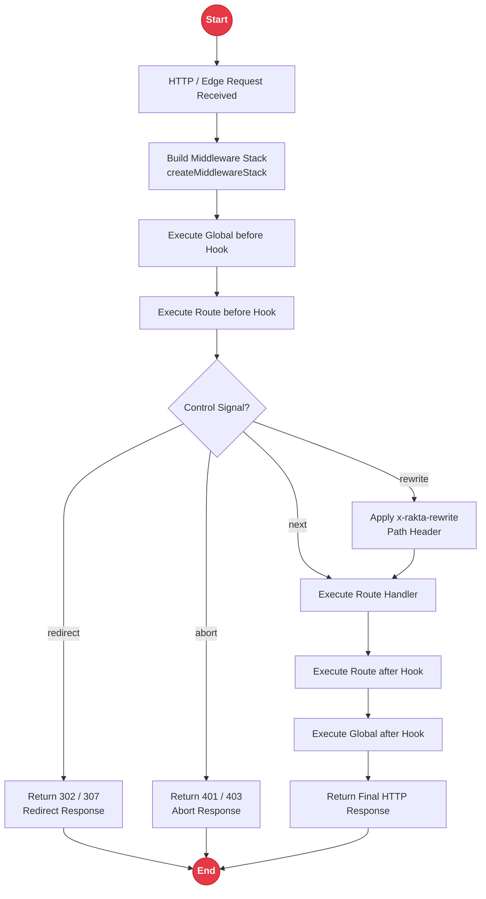

# Middleware Subsystem

Rakta.js middleware is an async request pipeline for global, route, nested, layout, API, and edge scopes. Middleware is exported from `rakta/middleware`.

---

## Middleware Pipeline Execution Flow



---

## Quick Start

```ts
import { before, createMiddlewareStack, redirect } from "rakta/middleware";

const stack = createMiddlewareStack([
  before((context) => {
    const isPrivateRoute = context.pathname.startsWith("/dashboard");
    const hasSession = context.request.headers.get("cookie")?.includes("rakta_session=");

    if (isPrivateRoute && !hasSession) {
      return redirect("/login");
    }
  }),
]);

const response = await stack.handle(request, () => new Response("OK"));
```

---

## API Reference

| API | Description |
| --- | --- |
| `createMiddlewareStack(middlewares)` | Creates a sequential async pipeline |
| `defineMiddleware(fn)` | Type-safe wrapper function for middleware |
| `before(fn)` | Executes logic prior to the downstream handler |
| `after(fn)` | Executes logic after downstream response generation |
| `redirect(url, status)` | Returns a redirect response |
| `rewrite(pathname)` | Returns a rewrite directive using `x-rakta-rewrite` |
| `abort(status, body)` | Terminates request with an immediate error response |

---

## Related Documentation

- [`kernel.md`](./kernel.md)
- [`templates.md`](./templates.md)
- [`routing.md`](./routing.md)
