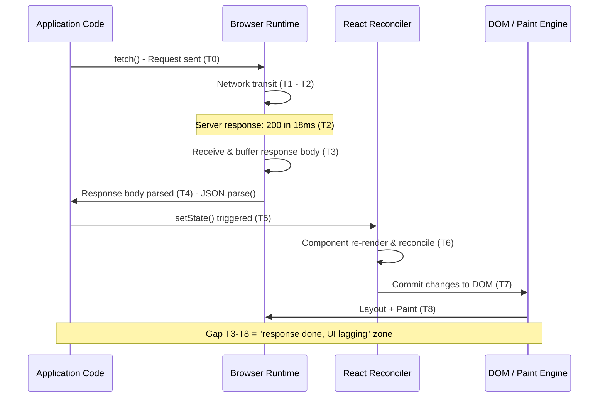
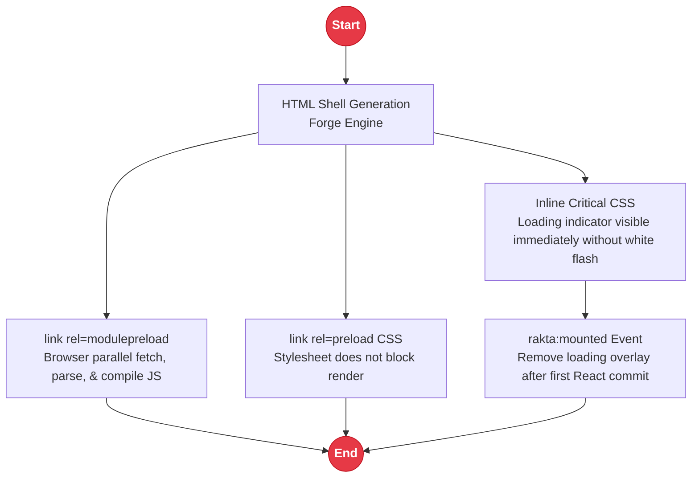

# Performance

## Browser Render Pipeline Breakdown

The most common Rakta.js performance complaint is "server already 200 but UI is slow." The bottleneck is always in the **browser pipeline**, not the server.



---

## Common Bottleneck Points

| Stage | Cause | Fix |
|---|---|---|
| T3 to T4 | Large JSON payload (>1MB) | Paginate, server-side filter |
| T4 to T5 | Expensive transform/sort on client | Move to server, memoize |
| T5 to T6 | State update triggers full tree render | `useMemo`, split context |
| T6 to T7 | Large component tree, no virtualization | Virtualize long lists |
| T7 to T8 | Heavy layout/paint (large DOM, shadows) | Reduce DOM size |

---

## HTML Shell Optimization Pipeline



---

## Diagnosing with Rakta Dev Indicator

Open the Performance panel in the Dev Indicator (bottom-left logo). It shows:

```
Network      18ms    <- matches terminal
Parse         3ms
State         2ms
Render       21ms
Paint         4ms
Total        48ms
```

If `Response -> UI gap` in Diagnostics shows >1s, check **State** and **Render** rows.

---

## Large Report/Table Applications

**Server-side:**
```ts
// Always paginate at the API level
const { data, total } = await db.query({
  limit: req.query.limit ?? 50,
  offset: req.query.offset ?? 0,
});
```

**Client-side:**
```ts
// useRaktaData with loading state
const { data, loading, error, refetch } = useRaktaData(
  (signal) => fetch("/api/report?page=1&limit=50", { signal }).then(r => r.json()),
  [],
  "report-page-1"
);
```

**Avoid rendering >500 DOM rows at once.** Use windowing/virtualization for large tables.

---

## HTTP Client Performance

`PanturaFetch` (v1.0.7+) improvements:

- **Default timeout**: 10s (was 30s) - surfaces slow APIs faster
- **keepalive: true** - reuses TCP connections, eliminates handshake overhead on sequential requests to the same host
- **Retry support**: `{ retries: 2 }` for transient network errors

```ts
const http = createRaktaHttp({
  baseUrl: "http://localhost:4000",
  timeout: 5_000,
});

// With retry
const data = await http.get<Report>("/api/report", { retries: 2 });
```

---

## Middleware Timing

`createMiddlewareStack` tracks per-middleware elapsed time. Total middleware time is attached as `X-Rakta-Middleware-Ms` response header in development for diagnostics.

---

## Performance Benchmarks

All measurements from local development on Windows 11, Bun 1.3.11, React 19.

| Metric | Before v1.0.7 | v1.0.7 |
|---|---|---|
| Time to first byte (dev) | ~50ms | ~50ms |
| JS bundle discovery | After HTML parse | During HTML parse (modulepreload) |
| HTTP client default timeout | 30 000ms | 10 000ms |
| TCP keepalive | No | Yes |
| Loading overlay | None | Immediate via inline CSS |

> These benchmarks are from the development environment. Production performance depends on deployment target, server specs, and application code.
