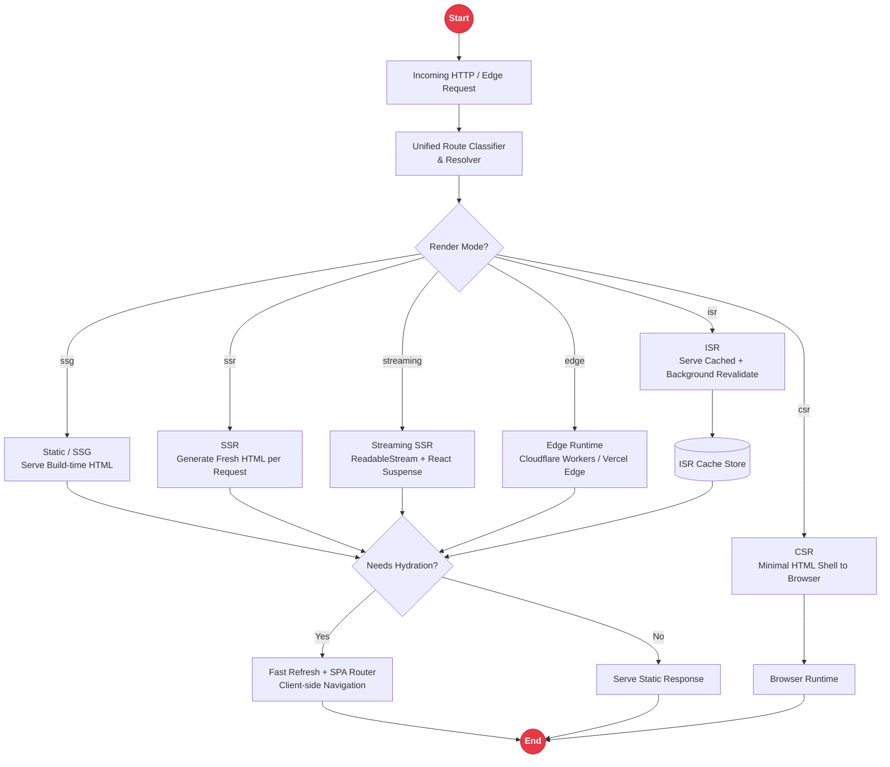

# Unified Rendering Architecture & Developer Experience (Fast Refresh / HMR) in Rakta.js

Rakta.js implements a **Unified Rendering Engine**, similar to Next.js App Router. Instead of fragmenting rendering strategies into isolated silos, Rakta.js seamlessly integrates Server Components, SSR, SSG, ISR, Streaming SSR, Edge Runtime, CSR, and Hybrid Rendering into a **single unified pipeline**.

---

## Fast Refresh vs. Hot Module Replacement (HMR)

Rakta.js features a state-of-the-art Developer Experience (DX) engine that delivers instant feedback as you edit your code.

### 1. Fast Refresh (In-Depth Explanation)
**Fast Refresh** is a built-in Rakta.js feature that automatically updates React components in the browser whenever you save a code file, **without losing component state**.

- **State Preservation**: Form inputs currently being typed into, scroll position, accordion/modal toggle states, and local React component state (`useState`, `useReducer`) **persist intact** and are not reset when saving files.
- **Resilient Recovery**: If you introduce a syntax or runtime error during coding, the Rakta Error Overlay immediately displays the stack trace. Once fixed and saved, the error overlay automatically dismisses and component state recovers seamlessly.
- **Granular Component Updates**: Only the modified component is re-evaluated and re-rendered in place, preserving the rest of the application tree.

### 2. Hot Module Replacement (HMR)
**Hot Module Replacement (HMR)** is the underlying low-level WebSocket protocol operating within the Rakta.js dev server (Forge Dev Server). HMR swaps modified JavaScript modules, CSS stylesheets, or static assets directly in browser memory without performing a full page reload (`window.location.reload()`).

#### Feature Comparison Matrix:

| Feature | Fast Refresh | Hot Module Replacement (HMR) |
| :--- | :--- | :--- |
| **Layer** | Application Level / React Component Hook | Bundler & Transport Layer (WebSocket Channel) |
| **Primary Goal** | Preserve React component state on file save | Hot-swap updated JS/CSS modules directly |
| **UI Behavior** | Components update instantly without resetting form/scroll | Modules updated in place without full page reload |
| **Integration** | Integrated with React Refresh Runtime & Rakta Shell | Uses WebSocket channel `/__livereload` |

---

## Unified Rendering Engine Architecture

In Rakta.js, you do not need to create separate projects for SSG, SSR, or Client SPA. The Rakta.js rendering engine automatically evaluates routes based on global configuration and route-level export declarations.



---

## 8 Rendering Strategies in a Unified Pipeline

### 1. Server-Side Rendering (SSR)
Every HTTP request triggers fresh HTML generation on the server. Ideal for dynamic pages requiring real-time data fetching and optimal SEO.

```tsx
// app/dashboard/page.tsx
export const mode = "ssr";

export default async function DashboardPage() {
  const data = await fetch("https://api.example.com/stats", { cache: "no-store" }).then(res => res.json());
  
  return (
    <main>
      <h1>Real-time Dashboard</h1>
      <pre>{JSON.stringify(data, null, 2)}</pre>
    </main>
  );
}
```

### 2. Static Site Generation (SSG)
Pages are pre-rendered into pure static HTML files during build time (`rakta build`). Delivers sub-millisecond TTFB via CDN deployment.

```tsx
// app/about/page.tsx
export const mode = "ssg";

export default function AboutPage() {
  return (
    <main>
      <h1>About Rakta.js</h1>
      <p>Fierce in speed. Zero overhead.</p>
    </main>
  );
}
```

### 3. Incremental Static Regeneration (ISR)
Combines the speed of SSG with the flexibility of SSR. Pages are served instantly from static cache and revalidated asynchronously in the background.

```tsx
// app/blog/[slug]/page.tsx
export const mode = "isr";
export const revalidate = 60; // Background revalidation every 60 seconds

export default function BlogPost({ params }: { params: { slug: string } }) {
  return (
    <article>
      <h1>Blog Post: {params.slug}</h1>
    </article>
  );
}
```

### 4. Streaming SSR (HTML ReadableStream)
Sends the initial HTML shell to the browser immediately and streams slower data dependencies via HTTP `ReadableStream` and React `<Suspense>` boundaries.

```tsx
// app/feed/page.tsx
import { Suspense } from "react";

export const mode = "streaming";

async function HeavyFeed() {
  const feed = await fetchHeavyFeedData();
  return <div>{feed.items.map(item => <p key={item.id}>{item.title}</p>)}</div>;
}

export default function FeedPage() {
  return (
    <main>
      <h1>Main Feed</h1>
      <Suspense fallback={<div>Loading Feed...</div>}>
        <HeavyFeed />
      </Suspense>
    </main>
  );
}
```

### 5. Edge Runtime Rendering
Executes rendering logic on edge infrastructure nearest to the end user (Cloudflare Workers, Vercel Edge, Deno Deploy) for ultra-low latency (< 5ms).

```tsx
// app/geo/page.tsx
export const mode = "edge";
export const runtime = "edge";

export default function GeoPage({ requestHeaders }: { requestHeaders: Record<string, string> }) {
  const country = requestHeaders["cf-ipcountry"] || "US";
  return <div>Your Region: {country}</div>;
}
```

### 6. Client-Side Rendering (CSR)
Pure browser-side rendering. Server serves a minimal HTML shell, and client JavaScript constructs the component hierarchy.

### 7. Single Page Application (SPA Mode)
Client-side routing with pre-loading, scroll restoration, route guards, and zero full page reloads.

### 8. Hybrid Rendering (Rakta Default)
Combines multiple rendering strategies in the same application. Public landing pages use SSG/ISR, auth routes use SSR/Edge, and interactive user dashboards use SPA/CSR.

---

## Global & Route-Level Configuration

Define default rendering policies in `rakta.config.ts` and override them per route.

### `rakta.config.ts` (Global Default)
```ts
import { defineConfig } from "raktajs/config";

export default defineConfig({
  renderMode: "hybrid", // Default global rendering mode
  seo: {
    title: "Rakta.js App",
    description: "High-performance fullstack application powered by Unified Rendering Engine.",
  },
  server: {
    port: 3000,
    host: "localhost",
  },
});
```

### `app/layout.tsx` (Root Layout & Metadata)
```tsx
import type { Metadata } from "raktajs";

export const metadata: Metadata = {
  title: "Rakta.js Application",
  description: "Powered by Unified Rendering & Fast Refresh Engine",
};

export default function RootLayout({ children }: { children: React.ReactNode }) {
  return (
    <html lang="en">
      <body>
        <nav>
          <a href="/">Home</a> | <a href="/dashboard">Dashboard</a>
        </nav>
        {children}
      </body>
    </html>
  );
}
```
