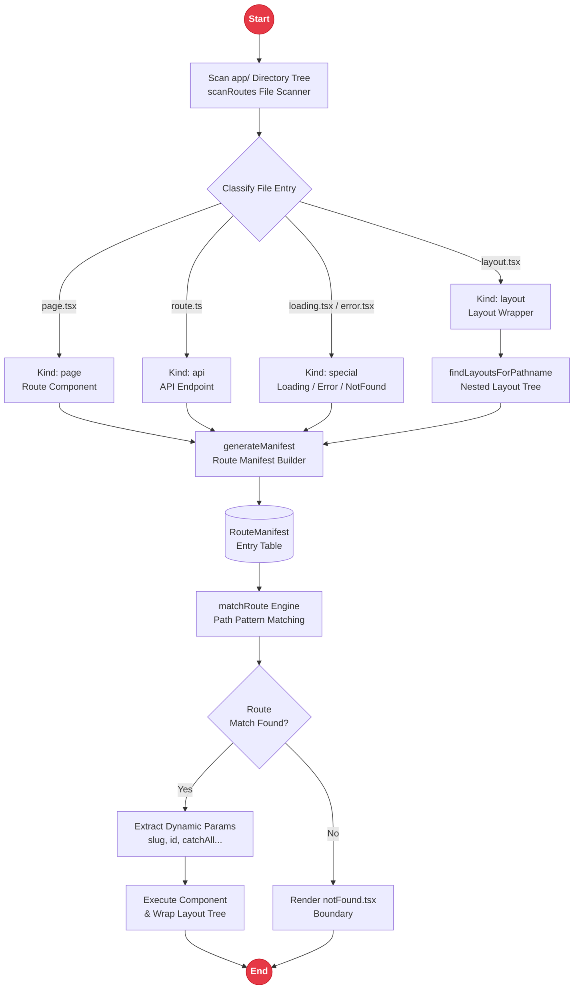

# File-Based Routing - MendungWeave

**MendungWeave** is the file-based routing layer in Rakta.js. The folder structure under `app/` is the router - there is no centralized route configuration file to maintain.

---

## Route Resolution Architecture & Lifecycle



---

## File Conventions

| File | Resolves To |
| --- | --- |
| `app/page.tsx` | `/` |
| `app/about/page.tsx` | `/about` |
| `app/blog/[slug]/page.tsx` | `/blog/:slug` (dynamic segment) |
| `app/blog/[...slug]/page.tsx` | `/blog/*` (catch-all) |
| `app/(auth)/login/page.tsx` | `/login` - `(auth)` is a route group and excluded from URL |
| `app/layout.tsx` | Root layout wrapping downstream routes |
| `app/loading.tsx` | Rendered while route segment is loading |
| `app/error.tsx` | Error boundary for route segment |
| `app/notFound.tsx` | Rendered when no route matches |
| `app/api/users/route.ts` | API endpoint at `/api/users` |

---

## Code Example

```tsx
// app/blog/[slug]/page.tsx
interface BlogPostPageProps {
  params: { slug: string };
}

export default function BlogPostPage({ params }: BlogPostPageProps) {
  return <h1>Post: {params.slug}</h1>;
}
```

```ts
// app/api/users/route.ts
export async function GET(): Promise<Response> {
  return Response.json({ users: [] });
}

export async function POST(request: Request): Promise<Response> {
  const body = await request.json();
  return Response.json({ created: body }, { status: 201 });
}
```

---

## Route Groups for Layout Isolation

Wrap folder names in parentheses to group routes under a shared layout without affecting the URL path:

```txt
app/
├─ (auth)/
│  ├─ layout.tsx        auth layout (login/register)
│  ├─ login/page.tsx     /login
│  └─ register/page.tsx  /register
├─ dashboard/
│  ├─ layout.tsx        dashboard sidebar layout
│  └─ page.tsx           /dashboard
└─ layout.tsx            public marketing layout
```

---

## Related Documentation

- [`templates.md`](./templates.md) - How routing is structured in generated templates
- [`seo.md`](./seo.md) - Per-route metadata
- [`rpc.md`](./rpc.md) - Type-safe RPC API