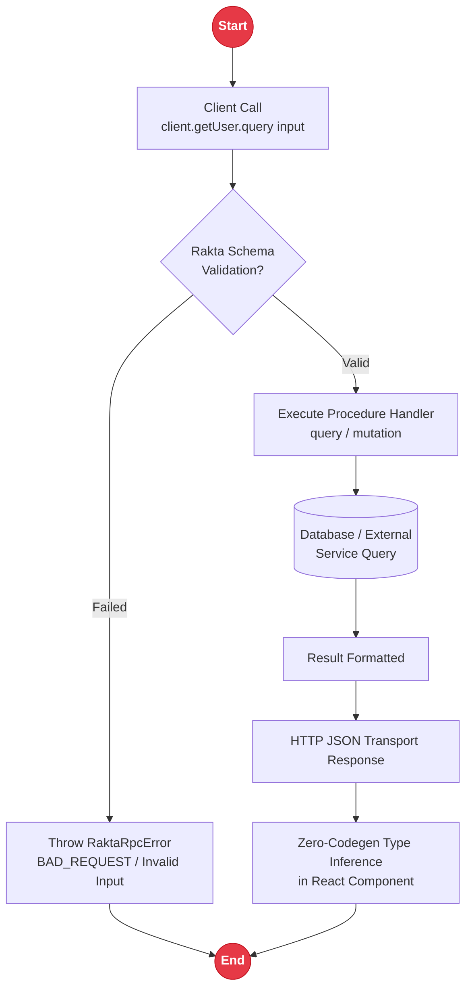

# RPC - CarubanWire

**CarubanWire** is the type-safe RPC layer in Rakta.js, providing zero-codegen end-to-end type safety between client and server.

---

## RPC Protocol & Type Inference Architecture



---

## Component Overview

- **Router**: Plain object mapping keys to procedures built with `publicProcedure`.
- **Procedure**: Fluent builder: `.input(schema)` attaches Rakta Schema validation, followed by `.query(handler)` or `.mutation(handler)`.
- **Client**: Instantiated via `createRaktaClient<AppRouter>()`, invoking `client.procedure.query(input)` sends a typed request and returns a fully typed response inferred from server router types.
- **Error**: Errors surface as `RaktaRpcError` with explicit `code` and optional validation failure details.

---

## Code Example

### Server Definition
```ts
// backend/src/rpc/router.ts
import { publicProcedure } from "rakta/rpc";
import { object, string } from "rakta/schema";

export const appRouter = {
  greet: publicProcedure
    .input(object({ name: string().min(1) }))
    .query(async ({ input }) => ({ message: `Hello, ${input.name}!` })),
};

export type AppRouter = typeof appRouter;
```

### Client Call
```ts
// frontend/lib/rpc.ts
import { createRaktaClient } from "rakta/rpc";
import type { AppRouter } from "../../backend/src/rpc/router";

export const rpc = createRaktaClient<AppRouter>({
  baseUrl: "http://localhost:4000/rpc",
});

const result = await rpc.greet.query({ name: "Rakta" });
// result.message: string - fully typed without code generation
```

---

## Related Documentation

- [`http.md`](./http.md) - PanturaFetch for non-RPC HTTP requests
- [`backendFrameworks.md`](./backendFrameworks.md) - Integrating CarubanWire with backend frameworks