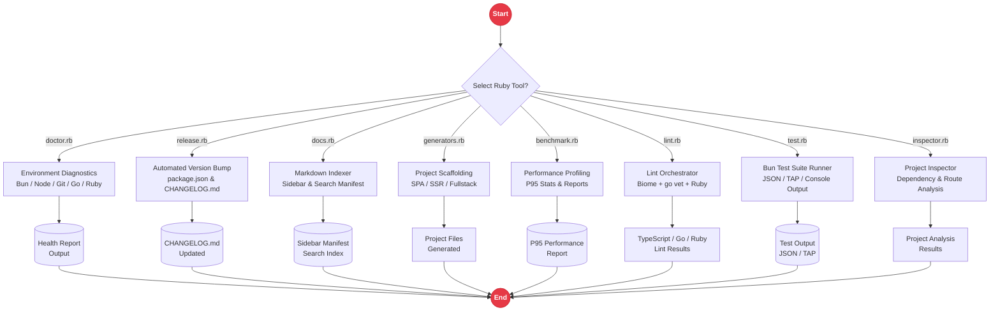

# Ruby Ecosystem Utilities in Rakta.js

Rakta.js includes Ruby ecosystem utilities for environment diagnostics, automated version releases, documentation indexing, linter orchestration, benchmark profiling, test running, and project generators.

---

## Ruby Tooling Architecture



---

## Utility Overview

1. **`doctor.rb`**: Diagnostic checker for Bun, Node, Git, Go, and Ruby runtime environments.
2. **`release.rb`**: Automated monorepo version bumper and CHANGELOG.md entry generator.
3. **`docs.rb`**: Markdown navigation parser and sidebar manifest indexer.
4. **`generators.rb`**: Project scaffolding generator for SPA, SSR, SSG, CSR, Dashboard, and Landing Page routes.
5. **`benchmark.rb`**: Performance profiling suite measuring startup latency, compilation timing, and monorepo file stats.
6. **`lint.rb`**: Multi-language linter orchestrator coordinating Biome (TS), `gofmt` & `go vet` (Go), and Ruby syntax checks.
7. **`test.rb`**: Automated test suite runner supporting JSON, TAP, and text console outputs.

---

## Script Execution

```bash
ruby tools/ruby/doctor.rb
ruby tools/ruby/lint.rb
ruby tools/ruby/benchmark.rb --suite=full
ruby tools/ruby/test.rb --reporter=json
```
