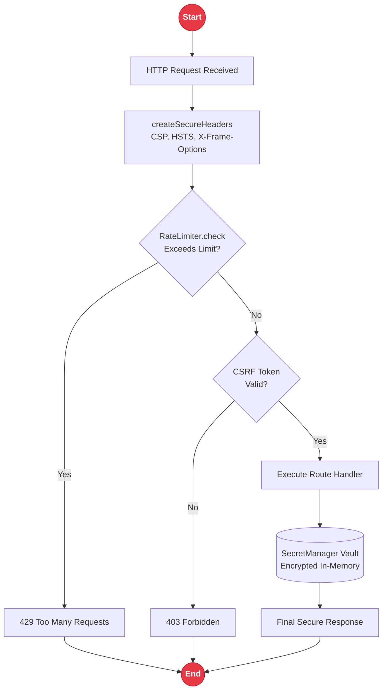

# Security - Production Security Layer

`rakta/security` provides production-oriented helpers for secure headers, CSP, CSRF tokens, rate limiting, and secret management - no extra dependencies, edge-runtime compatible.

---

## Security Layer Architecture



---

## Security Components

### Secure Headers

```ts
import { createSecureHeaders } from "rakta/security";

const headers = createSecureHeaders();
// Content-Security-Policy, X-Frame-Options, X-Content-Type-Options,
// Strict-Transport-Security, Permissions-Policy
```

### CSRF Protection

```ts
import { createCsrfToken, verifyCsrfToken } from "rakta/security";

const token = createCsrfToken("csrf-secret");
verifyCsrfToken(token, "csrf-secret"); // throws on invalid
```

### Rate Limiter

```ts
import { RateLimiter } from "rakta/security";

const limiter = new RateLimiter();
const state = limiter.check("user:1", 100, 60_000);
// { allowed: boolean, remaining: number, resetAt: number }
```

### Secret Manager

```ts
import { SecretManager } from "rakta/security";

const secrets = new SecretManager();
secrets.set({ name: "jwt", value: "secret" });
const jwt = secrets.get("jwt");
```

---

## Related

- [`middleware.md`](./middleware.md) - integrating the security layer into the middleware pipeline
- [`authentication.md`](./authentication.md) - JWT and session authentication
