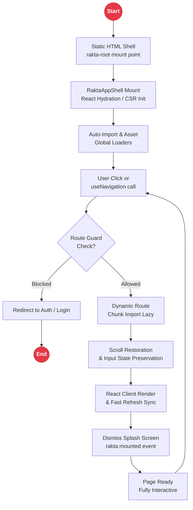

# Single Page Application (SPA) Mode in Rakta.js

Single Page Application (SPA) is a first-class supported rendering mode in Rakta.js.

---

## SPA Lifecycle & Client Navigation Architecture



---

## Key Features

- Instant client-side navigation via `<click to="...">` or `useNavigation()`
- Automatic code splitting and route lazy loading
- Built-in scroll restoration (`<ScrollRestoration />`)
- Page protection & route guards (`useRouteGuard()`)
- SPA error boundary isolation (`<SpaErrorBoundary />`)

---

## Enabling SPA Mode

In `rakta.config.ts`:

```ts
import { defineConfig } from "raktajs/config";

export default defineConfig({
  mode: "spa",
  spa: true,
  autoImport: {
    enabled: true,
  },
});
```

CLI flag:

```bash
rakta create my-app --spa
```

---

## Route Guard Example

```tsx
import { useRouteGuard } from "raktajs/spa";

export default function ProtectedDashboard() {
  useRouteGuard(({ pathname }) => {
    const authenticated = Boolean(localStorage.getItem("token"));
    if (!authenticated) {
      return "/login";
    }
    return true;
  });

  return <div>Welcome to Protected Dashboard</div>;
}
```
