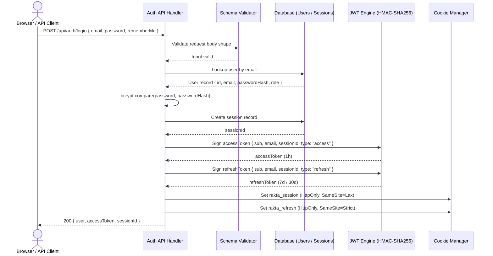
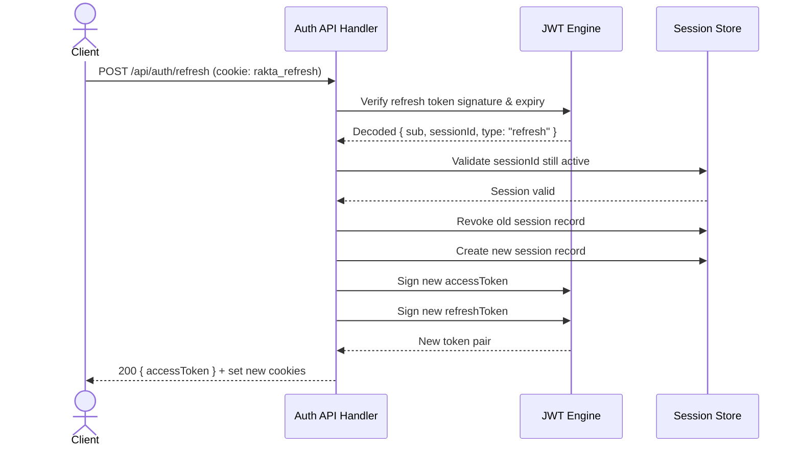

# Autentikasi

Autentikasi self-hosted yang di-generate oleh Rakta.js fullstack generator. Tidak ada Clerk, NextAuth, Supabase, atau Firebase.

---

## Arsitektur Autentikasi JWT + Session



---

## Alur Refresh Token Rotation



---

## Strategi Autentikasi

Saat generate fullstack project, pilih dari:

| Strategi | Deskripsi |
|---|---|
| **None** | Tidak ada autentikasi yang di-generate |
| **JWT** | Pasangan access + refresh token stateless |
| **Session** | Session server-side dengan cookie |
| **JWT + Session** | Kedua strategi sekaligus |

---

## Endpoint yang Di-generate

| Endpoint | Method | Auth Diperlukan | Deskripsi |
|---|---|---|---|
| `/api/auth/register` | POST | Tidak | Buat akun |
| `/api/auth/login` | POST | Tidak | Mengembalikan `accessToken` + set cookies |
| `/api/auth/refresh` | POST | Tidak (refresh token) | Rotasi pasangan token |
| `/api/auth/me` | GET | Ya | User saat ini |
| `/api/auth/logout` | POST | Ya | Cabut session saat ini |
| `/api/auth/logout-all` | POST | Ya | Cabut semua session |
| `/api/auth/forgot-password` | POST | Tidak | Minta OTP |
| `/api/auth/reset-password` | POST | Tidak | Reset dengan OTP |
| `/api/auth/oauth/:provider/login` | GET | Tidak | Mulai sign-in lewat provider yang dipilih |
| `/api/auth/oauth/:provider/callback` | GET | Tidak | Callback dari provider, kembali ke frontend |

---

## Login

```bash
curl -X POST http://localhost:4000/api/auth/login \
  -H "Content-Type: application/json" \
  -d '{
    "email": "admin@example.com",
    "password": "password-kamu",
    "rememberMe": true
  }'
```

Response:

```json
{
  "success": true,
  "data": {
    "user": { "id": "...", "email": "admin@example.com", "role": "ADMIN" },
    "accessToken": "<JWT berumur pendek>",
    "sessionId": "<session-id>"
  }
}
```

Dua cookie otomatis di-set:
- `rakta_session` - session ID (HttpOnly, SameSite=Lax)
- `rakta_refresh` - refresh token (HttpOnly, SameSite=Strict)

---

## Menggunakan Access Token

```bash
# Bearer token (API client)
curl http://localhost:4000/api/auth/me \
  -H "Authorization: Bearer <accessToken>"

# Cookie (browser - otomatis setelah login)
curl http://localhost:4000/api/auth/me --cookie "rakta_session=<sessionId>"
```

---

## Melindungi Route

```ts
import { requireAuth, requireRole, optionalAuth } from "../middlewares/auth.middleware";

// Require user yang sudah login
const rejected = await requireAuth(request);
if (rejected) return rejected;

// Require role tertentu
const rejected = await requireRole(request, "ADMIN");
if (rejected) return rejected;

// Opsional - dapatkan user jika sudah login
const user = await optionalAuth(request);
```

---

## Session Policy

| Policy | SESSION_MODE | Perilaku |
|---|---|---|
| Multiple Sessions | `multiple` | Default - login dari banyak device diizinkan |
| Single Session | `single` | Login baru mencabut semua session sebelumnya |

---

## Keamanan Token

- JWT ditandatangani dengan HMAC-SHA256 menggunakan `AUTH_SECRET`
- Access token berisi: `{ sub, email, sessionId, type: "access", exp }`
- Refresh token berisi: `{ sub, email, sessionId, type: "refresh", exp }`
- Token dengan `type: "refresh"` ditolak oleh `authenticate()`

---

## Environment Variables

```env
AUTH_SECRET=ganti-dengan-secret-acak-32-karakter
SESSION_MODE=multiple
AUTH_STRATEGY=jwt
CORS_ORIGIN=http://localhost:3000
OAUTH_REDIRECT_BASE_URL=http://localhost:4000
```

---

## OAuth Providers (Opsional)

Saat generate project fullstack, kamu bisa memilih satu atau lebih provider OAuth, atau mengosongkannya sama sekali. Jika tidak ada yang dipilih, semua route OAuth dilewati dan tombol provider di halaman sign-in disembunyikan. Provider yang kamu pilih dipasang ke tiga tempat:

- **Route backend** — semua backend yang didukung (Gaman.js, Nest.js, Express, Adonis, Hono, Laravel, CodeIgniter, Flask, Django, Prabogo, Beego, Rails, Hanami, Spring Boot, Jakarta EE) menghasilkan route authorization dan callback untuk setiap provider terpilih, misalnya `/api/auth/oauth/google/login` dan `/api/auth/oauth/google/callback`.
- **Environment variables** — `.env.example` setiap backend langsung menuliskan variabel per provider (bukan placeholder generik), seperti `GOOGLE_CLIENT_ID`, `GOOGLE_CLIENT_SECRET`, `GOOGLE_REDIRECT_URI`, dan pasangannya untuk provider lain. `OAUTH_REDIRECT_BASE_URL` menjadi dasar callback default bila redirect URI spesifik-provider tidak diisi.
- **Halaman sign-in** — template fullstack merender satu tombol per provider terpilih (ikon merek plus nama) di bawah form email dan password. Tombol hanya muncul untuk provider yang kamu pilih saat generate.

Ada tujuh provider bawaan: Google, GitHub, Apple, Microsoft, Discord, GitLab, dan Facebook. Kamu juga bisa memilih **custom**, yang alurnya sama persis tetapi URL authorize dan token diisi sendiri oleh kamu.

Konfigurasi tetap manual. Rakta.js tidak pernah bergantung pada platform auth pihak ketiga. Kamu membuat aplikasi di sisi provider, menyalin client ID dan secret ke environment, lalu mendaftarkan URL callback ke aplikasi kamu.

---

## Terkait

- [Panduan Upgrade](./migrationGuide.md)
- [Performa](./performance.md)
- [Dev Tools](./devtools.md)
