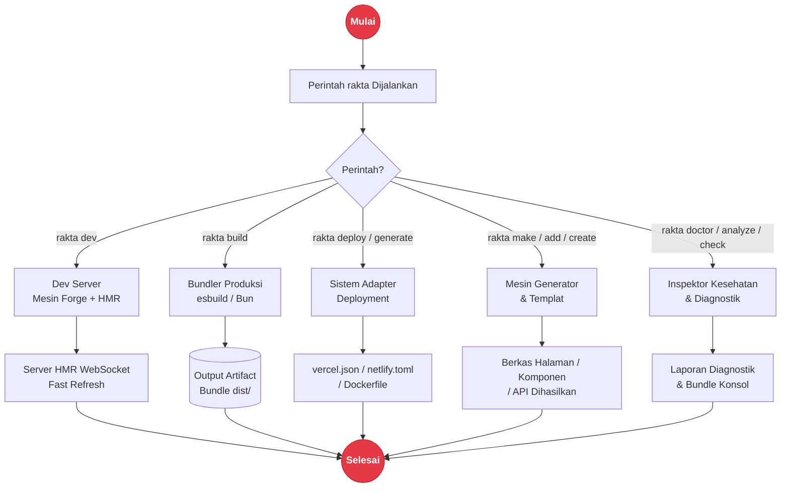

# Rakta CLI Tooling

Command `rakta` adalah control surface framework untuk development lokal, generator, diagnostics, inspeksi build, setup deployment, dan perawatan project.

---

## Alur Kerja CLI



---

## Command Inti

| Command | Kegunaan |
| --- | --- |
| `rakta dev` | Menjalankan development server dengan Fast Refresh & HMR |
| `rakta build` | Build aplikasi untuk lingkungan produksi |
| `rakta build --analyze` | Build lalu cetak laporan inspeksi Forge |
| `rakta start` | Menjalankan server production |
| `rakta routes` | Menampilkan manifest route berbasis file |
| `rakta doctor` | Mengecek kesehatan environment dan project |
| `rakta analyze` | Menginspeksi output build dan mode render route |
| `rakta benchmark` | Menjalankan benchmark lokal route manifest |
| `rakta upgrade [version]` | Mengupdate dependency Rakta.js di `package.json` |
| `rakta check` | Menjalankan script typecheck dan lint |
| `rakta lint` | Menjalankan pengecekan Biome |
| `rakta format` | Memformat project dengan Biome |

---

## Generator

```bash
rakta create page dashboard
rakta add component Button
rakta make:api users
rakta generate deployment vercel
```

`create` dan `add` adalah alias dari generator `make:*`. Generator deployment menulis file native platform seperti `vercel.json`, `netlify.toml`, `wrangler.toml`, atau `Dockerfile`.

---

## Plugin dan Telemetry

```bash
rakta plugin list
rakta plugin create analytics
rakta telemetry on
rakta telemetry off
```

---

## Dokumen Terkait

- [`deployment.md`](./deployment.md)
- [`kernel.md`](./kernel.md)
- [`autoImport.md`](./autoImport.md)
