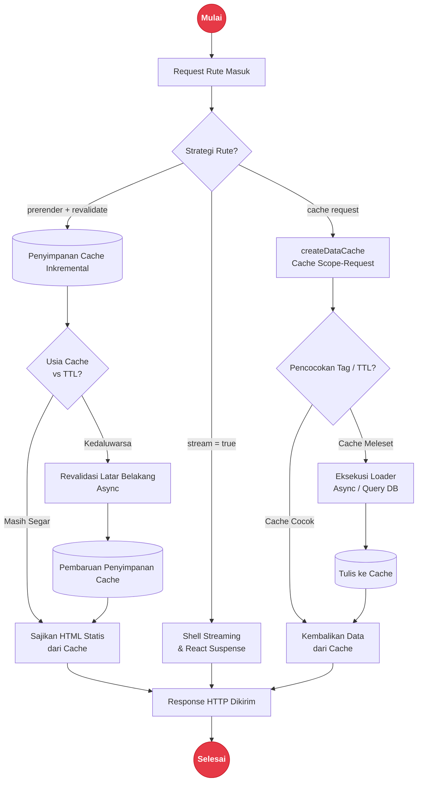

# Pengambilan Data (Data Fetching)

Modul `rakta/data` menyediakan templat cache data ringan, kontrak strategi data rute, serta fungsi pembantu untuk mengidentifikasi rute ISR, streaming, dan prefetch. Primitif ini digunakan oleh mesin build Forge, runtime Tide, dan renderer kustom untuk menentukan bagaimana setiap rute diambil, disimpan di cache, dan dirender ulang.

---

## Arsitektur Lifecycle Pengambilan Data & Caching



---

## API Cache Data

`createDataCache()` mengembalikan instans cache untuk satu siklus hidup permintaan. Entri disimpan dengan kata kunci string dan dapat dibatalkan berdasarkan tag.

```ts
import { createDataCache } from "raktajs/data";

const cache = createDataCache();

// Simpan hasil pemuat ke dalam cache selama 60 detik dengan tag "cms"
const posts = await cache.cache("cms:posts", () => fetchPostsFromDB(), {
  ttl: 60_000,
  tags: ["cms"],
});

// Batalkan semua cache dengan tag "cms"
cache.revalidate("cms");

// Batalkan kunci tunggal
cache.revalidate("cms:posts");
```

### Opsi Cache

| Opsi | Tipe | Default | Deskripsi |
| --- | --- | --- | --- |
| `ttl` | `number` | `0` (tidak pernah kadaluwarsa) | Masa berlaku dalam milidetik |
| `tags` | `string[]` | `[]` | Tag untuk pembatalan kelompok |

---

## Strategi Data Rute

`defineRouteDataStrategy` mengelompokkan rute dengan strategi rendering dan kontrak datanya:

```ts
import { defineRouteDataStrategy, isIncrementalRoute, shouldStreamRoute, shouldPrefetchRoute } from "raktajs/data";

const dashboardStrategy = defineRouteDataStrategy({
  routePattern: "/dashboard",
  runtime: "server",    // "server" | "client" | "edge"
  prerender: false,      // true = SSG / ISR saat build
  stream: true,          // true = aktifkan respon streaming
  prefetch: true,        // true = prefetch saat hover
  revalidate: 60,        // interval revalidasi ISR dalam detik
});

const blogStrategy = defineRouteDataStrategy({
  routePattern: "/blog/:slug",
  runtime: "server",
  prerender: true,       // pra-render saat build
  stream: false,
  prefetch: true,
  revalidate: 3600,      // buat ulang setiap jam
});

// Fungsi Pengecekan
isIncrementalRoute(dashboardStrategy); // false - prerender bernilai false
isIncrementalRoute(blogStrategy);      // true  - prerender + revalidate
shouldStreamRoute(dashboardStrategy);  // true
shouldPrefetchRoute(dashboardStrategy); // true
```

---

## Dokumentasi Terkait

- [`routing.md`](./routing.md) - routing berbasis berkas
- [`layout.md`](./layout.md) - sistem layout dan status pemuatan
- [`rpc.md`](./rpc.md) - panggilan API bertipe presisi
