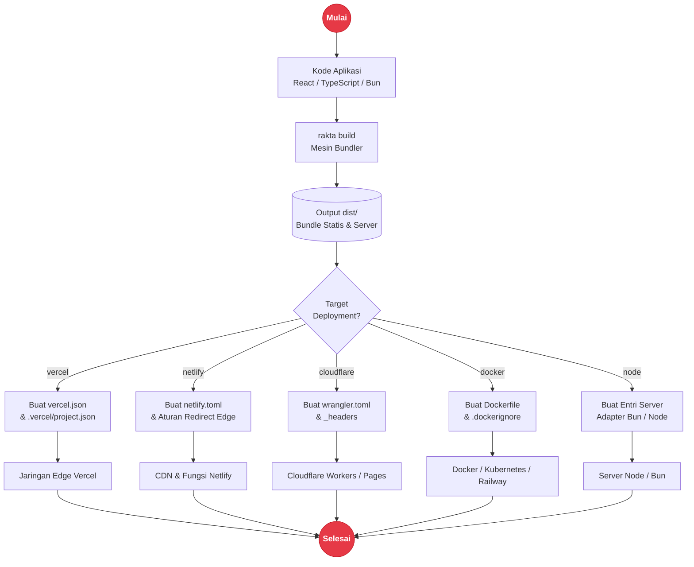

# Deployment & Target Adapters

Project Rakta.js berbasis Bun dan bisa dideploy sebagai frontend statis, server Bun, container Docker, atau serverless/edge platform untuk Vercel, Netlify, Cloudflare Workers/Pages, AWS Lambda, Railway, dan Fly.io.

---

## Arsitektur Pipeline Deployment



---

## Command Generator CLI

```bash
rakta generate deployment vercel
rakta generate deployment netlify
rakta generate deployment cloudflare-workers
rakta generate deployment docker
```

File yang dihasilkan sengaja ringkas dan mengikuti spesifikasi native platform tujuannya. Adapter Vercel menulis `vercel.json` dan `.vercel/project.json`, Netlify menulis `netlify.toml`, Cloudflare menulis `wrangler.toml`, dan Docker menulis `Dockerfile` plus `.dockerignore`.

---

## API Adapter Deployment

Gunakan API adapter ketika plugin, template, atau tool internal perlu menyiapkan file deployment secara terprogram:

```ts
import { createDeploymentAdapter } from "raktajs/deployment";

const adapter = createDeploymentAdapter("vercel", {
  appName: "my-rakta-app",
  outDir: "dist",
});

for (const file of adapter.files) {
  console.log(file.path, file.content);
}
```

### Target yang Didukung

| Target | Runtime |
| --- | --- |
| `node` | Server kompatibel Node |
| `bun` | Server Bun Native |
| `deno` | Server Deno |
| `cloudflare-workers` | Edge worker |
| `cloudflare-pages` | Hosting edge statis |
| `netlify` | Hosting statis atau edge |
| `vercel` | Hosting statis atau edge |
| `docker` | Aplikasi Bun dalam container |
| `aws-lambda` | Function serverless |
| `fly` | Service Bun/Node |
| `railway` | Service Bun/Node |
| `render` | Service Bun/Node |
| `firebase` | Hosting statis |
| `github-pages` | Hosting statis |
| `static` | Static export generik |

---

## Environment Variables

| Variable | Kegunaan |
| --- | --- |
| `PORT` | Port server backend |
| `CORS_ORIGIN` | Origin frontend yang diizinkan oleh API |
| `DATABASE_URL` | Connection string database |
| `AUTH_SECRET` | Secret untuk signing JWT, minimal 32 karakter |
| `SESSION_MODE` | Perilaku session `single` atau `multi` |

---

## Dokumen Terkait

- [`templates.md`](./templates.md)
- [`kernel.md`](./kernel.md)
- [`middleware.md`](./middleware.md)
- [`docsSystem.md`](./docsSystem.md)
