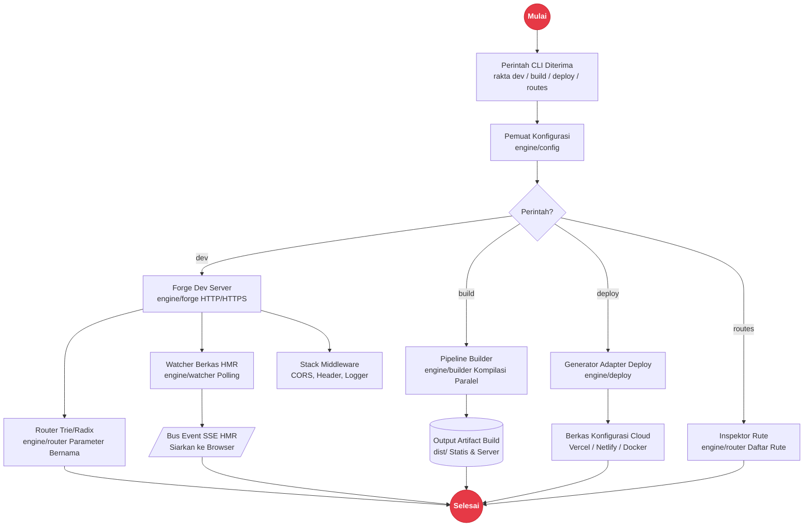

# Rakta Engine (Golang Native Tooling)

Rakta Engine adalah engine bawaan Golang berperforma tinggi yang mentenagai dev server, pipeline build, HMR file watcher, router native, dan adapter deployment Rakta.js.

---

## Arsitektur Engine Golang



---

## Komponen Engine

1. **Rakta Forge (`engine/forge`)**: Development server HTTP/HTTPS berkecepatan tinggi dengan bridge SSE HMR dan reverse proxy.
2. **Rakta Router (`engine/router`)**: Router Trie/Radix native Go dengan dukungan named parameters (`:id`), catch-all (`*`), dan middleware stack.
3. **Rakta Watcher (`engine/watcher`)**: Watcher berkala berbasis polling dengan deteksi modifikasi file inkremental untuk HMR.
4. **Rakta Builder (`engine/builder`)**: Pipeline kompilasi paralel, pemindai dependency graph, dan cache hash inkremental.
5. **Rakta Middleware (`engine/middleware`)**: Layer middleware request native dengan fitur CORS, Secure Headers, dan Logger.
6. **Rakta Config (`engine/config`)**: Loader konfigurasi JSON/TS terstruktur dengan validasi dan environment reader.
7. **Rakta Deploy (`engine/deploy`)**: Pembuat konfigurasi deployment otomatis untuk Vercel, Netlify, Cloudflare, Railway, dan Docker.

---

## Kompilasi Binary Native

Anda dapat mengkompilasi binary native Golang untuk eksekusi lintas platform:

```bash
cd engine
go build -o rakta ./cmd/cli
```
