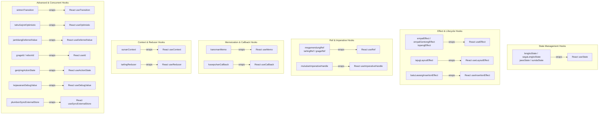

# Hooks Rakta

## Gambaran Umum

Hooks Rakta diinspirasi oleh ciri khas warisan budaya, kuliner, dan sejarah (seperti Jawa, Sunda, Sega Lengko, Empal Gentong, Batik Megamendung, Keraton Kasepuhan, Keraton Kanoman, Sunan Gunung Jati, Musik Tarling, Tari Sintren, dll.).

Hooks ini sangat berguna ketika Auto Import dimatikan dan Anda tetap ingin menulis kode dengan identitas Rakta.js yang kaya akan kearifan lokal.

---

## Pemetaan Hooks - React ke Rakta.js



---

## Mulai Cepat

```tsx
import { empalEffect, lengkoState, megamendungRef } from "raktajs/hooks";

export default function Counter() {
  const [count, setCount] = lengkoState(0);
  const buttonRef = megamendungRef<HTMLButtonElement>(null);

  empalEffect(() => {
    buttonRef.current?.focus();
  }, []);

  return (
    <button ref={buttonRef} onClick={() => setCount(count + 1)}>
      {count}
    </button>
  );
}
```

---

## Referensi API Hooks

| Nama Hook Rakta | Ciri Khas / Warisan Budaya | Padanan React |
| --- | --- | --- |
| `lengkoState` / `segaLengkoState` | Sega Lengko (Kuliner) | `useState` |
| `jawaState` / `sundaState` | Akulturasi 2 Suku (Jawa & Sunda) | `useState` |
| `empalEffect` / `empalGentongEffect` | Empal Gentong (Kuliner) | `useEffect` |
| `topengEffect` | Tari Topeng | `useEffect` |
| `megamendungRef` | Batik Megamendung (Motif Iconic) | `useRef` |
| `tarlingRef` / `grageRef` | Tarling / Kota Udang | `useRef` |
| `kanomanMemo` | Keraton Kanoman | `useMemo` |
| `kasepuhanCallback` | Keraton Kasepuhan | `useCallback` |
| `sunanContext` | Sunan Gunung Jati | `useContext` |
| `tarlingReducer` | Seni Musik Tarling | `useReducer` |
| `sintrenTransition` | Seni Tari Sintren | `useTransition` |
| `tahuGejrotOptimistic` | Tahu Gejrot (Kuliner Khas) | `useOptimistic` |
| `grageId` / `rebonId` | Grage / Rebon | `useId` |
| `tajugLayoutEffect` | Tajug (Masjid Sang Cipta Rasa) | `useLayoutEffect` |
| `genjringActionState` | Genjring Akrobat | `useActionState` |
| `kejawananDebugValue` | Pelabuhan Kejawanan | `useDebugValue` |
| `jamblangDeferredValue` | Nasi Jamblang | `useDeferredValue` |
| `muludanImperativeHandle` | Tradisi Pelungan Muludan | `useImperativeHandle` |
| `batuLawangInsertionEffect` | Wisata Batu Lawang | `useInsertionEffect` |
| `plumbonSyncExternalStore` | Sentra Kerajinan Plumbon | `useSyncExternalStore` |

---

## Perilaku Generator CLI

Saat menjalankan CLI `create-rakta-app`, jika opsi Auto Import dimatikan (`autoImport: false`), berkas starter yang dihasilkan akan mengimpor hooks secara otomatis menggunakan penamaan ciri khas budaya (`lengkoState`, `empalEffect`, `megamendungRef`, dll.) dari `raktajs/hooks`.

---

## Dokumen Terkait

- [Auto Import](./autoImport.md)
- [Framework Core](./kernel.md)
