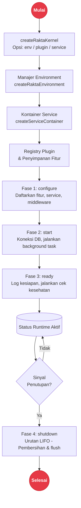

# Kernel dan Sistem Plugin

Kernel Rakta.js adalah fondasi production untuk service framework, akses environment, registrasi fitur, dan lifecycle plugin. Kernel tersedia dari `rakta/kernel` dan diekspor dari package utama `raktajs`.

---

## Arsitektur Kernel & Service Container



---

## Arsitektur Layer

| Layer | Tanggung jawab |
| --- | --- |
| Service container | Mendaftarkan value dan factory dengan lifetime singleton atau transient |
| Environment | Membaca `RAKTA_ENV`, `NODE_ENV`, dan record environment eksplisit |
| Feature registry | Membantu plugin mengumumkan kapabilitas framework |
| Lifecycle plugin | Menjalankan hook `configure`, `start`, `ready`, dan `shutdown` |

---

## Mulai Cepat

```ts
import { createRaktaKernel } from "rakta/kernel";

const kernel = createRaktaKernel({
  environmentName: "production",
  env: {
    API_URL: "https://api.example.com",
  },
});

kernel.services.singleton("apiUrl", () =>
  kernel.environment.require("API_URL")
);

await kernel.start();

const apiUrl = await kernel.services.resolve<string>("apiUrl");
```

---

## Sistem Plugin

Plugin adalah object TypeScript biasa. Plugin bisa mendaftarkan service, mengekspos fitur, dan menjalankan pekerjaan startup atau shutdown.

```ts
import type { RaktaPlugin } from "rakta/kernel";

export const authPlugin: RaktaPlugin = {
  name: "auth",
  configure(context) {
    context.registerFeature({
      name: "auth",
      options: {
        strategy: "session",
      },
    });
  },
  start(context) {
    context.services.value("auth.ready", true);
  },
};
```

---

## Referensi API

| API | Deskripsi |
| --- | --- |
| `createRaktaKernel(options)` | Membuat kernel dengan service, environment, plugin, dan fitur |
| `createServiceContainer()` | Membuat service container type-safe secara mandiri |
| `createRaktaEnvironment(name, env)` | Membuat pembaca environment secara mandiri |
| `kernel.use(plugin)` | Mendaftarkan plugin sebelum startup |
| `kernel.start()` | Menjalankan hook `configure`, `start`, lalu `ready` |
| `kernel.shutdown()` | Menjalankan hook shutdown dengan urutan plugin terbalik |
| `kernel.snapshot()` | Mengembalikan diagnostik runtime read-only |
| `services.singleton(key, factory)` | Mendaftarkan factory service yang di-cache |
| `services.value(key, value)` | Mendaftarkan service berupa nilai tetap |
| `services.resolve(key)` | Mengambil service atau melempar error yang jelas |
| `services.tryResolve(key)` | Mengambil service atau mengembalikan `undefined` |

---

## Dokumen Terkait

- [`mulai.md`](./mulai.md)
- [`templates.md`](./templates.md)
- [`autoImport.md`](./autoImport.md)
- [`routing.md`](./routing.md)
