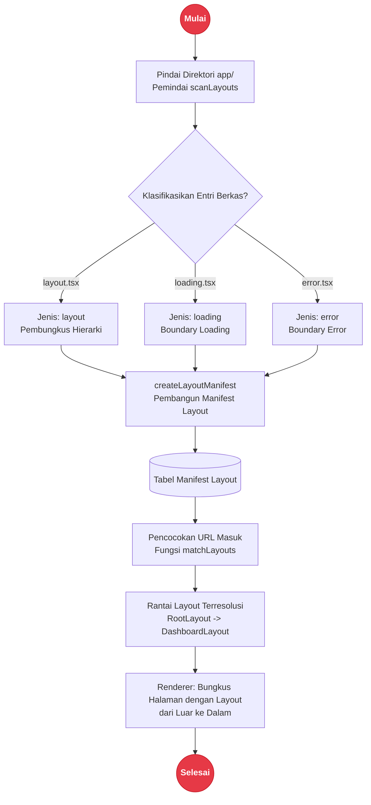
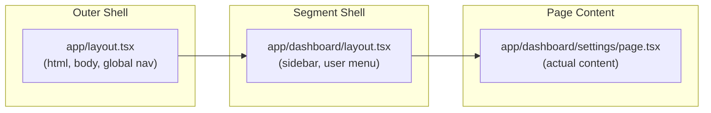

# Sistem Layout

Rakta.js menggunakan sistem layout berbasis berkas yang serupa dengan konvensi direktori `app/`. Layout membungkus halaman dan bertahan saat navigasi antar segmen URL yang sama. Modul `rakta/layout` menyediakan pemindai (scanner), pembuat manifes, dan pencocok (matcher) yang digunakan oleh mesin build Forge dan perkakas kustom.

---

## Arsitektur Sistem Layout



---

## Hierarki Layout Bersarang (Nested Layout Chain)



---

## Konvensi Berkas

| Berkas | Tujuan |
| --- | --- |
| `app/layout.tsx` | Root layout - membungkus seluruh halaman di aplikasi |
| `app/dashboard/layout.tsx` | Layout bersarang - membungkus rute di bawah `/dashboard` |
| `app/dashboard/loading.tsx` | Skeleton pemuatan saat segmen rute dimuat |
| `app/dashboard/error.tsx` | Pembatas kesalahan (error boundary) untuk segmen dashboard |
| `app/(auth)/layout.tsx` | Layout grup rute - tidak menambahkan segmen URL |
| `app/dashboard/@analytics/layout.tsx` | Slot paralel - dirender berdampingan dengan konten utama |

---

## Root Layout

Setiap aplikasi Rakta.js wajib memiliki root layout di `app/layout.tsx`. Berkas ini bertanggung jawab untuk elemen `<html>` dan `<body>`:

```tsx
// app/layout.tsx
interface RootLayoutProps {
  readonly children: React.ReactNode;
}

export default function RootLayout({ children }: RootLayoutProps) {
  return (
    <html lang="en">
      <body>{children}</body>
    </html>
  );
}
```

---

## Layout Bersarang (Nested Layouts)

Buat berkas `layout.tsx` di dalam folder segmen mana pun untuk membungkus rute di dalamnya:

```txt
app/
├─ layout.tsx           root layout (membungkus semua)
├─ page.tsx             /
├─ dashboard/
│  ├─ layout.tsx        layout dashboard (sidebar, menu pengguna)
│  ├─ page.tsx          /dashboard
│  ├─ settings/
│  │  └─ page.tsx       /dashboard/settings
│  └─ analytics/
│     └─ page.tsx       /dashboard/analytics
└─ (auth)/
   ├─ layout.tsx        layout auth (tanpa sidebar, form di tengah)
   ├─ login/page.tsx    /login
   └─ register/page.tsx /register
```

Rantai layout untuk `/dashboard/settings` adalah: `app/layout.tsx` kemudian `app/dashboard/layout.tsx`.

---

## Grup Rute untuk Isolasi Layout

Bungkus folder dengan tanda kurung - `(auth)` - untuk mengelompokkan rute di bawah satu layout bersama tanpa menambahkan segmen URL. Tanda kurung diabaikan dalam URL:

```tsx
// app/(auth)/layout.tsx - berlaku untuk /login, /register, /forgot-password
export default function AuthLayout({ children }: { children: React.ReactNode }) {
  return (
    <main className="auth-shell">
      <div className="auth-card">{children}</div>
    </main>
  );
}
```

---

## API Layout (`rakta/layout`)

```ts
import { createLayoutManifest, matchLayouts } from "raktajs/layout";
import type { RaktaLayoutManifest, RaktaLayoutEntry } from "raktajs/layout";

// Buat manifes dari daftar jalur berkas
const manifest: RaktaLayoutManifest = createLayoutManifest([
  { path: "app/layout.tsx" },
  { path: "app/dashboard/layout.tsx" },
  { path: "app/dashboard/loading.tsx" },
  { path: "app/dashboard/error.tsx" },
  { path: "app/(auth)/layout.tsx" },
  { path: "app/dashboard/@analytics/layout.tsx" },
]);

// Dapatkan rantai layout aktif untuk suatu jalur URL
const activeLayouts: RaktaLayoutEntry[] = matchLayouts(manifest, "/dashboard/settings");
// [app/layout.tsx, app/dashboard/layout.tsx]
```

---

## Layout Khusus

### Layout Loading

```tsx
// app/dashboard/loading.tsx
export default function DashboardLoading() {
  return (
    <div className="skeleton-shell">
      <div className="skeleton-sidebar" />
      <div className="skeleton-content" />
    </div>
  );
}
```

### Layout Error

```tsx
// app/dashboard/error.tsx
interface ErrorLayoutProps {
  readonly error: Error;
  readonly reset: () => void;
}

export default function DashboardError({ error, reset }: ErrorLayoutProps) {
  return (
    <section>
      <h2>Terjadi kesalahan pada dashboard</h2>
      <p>{error.message}</p>
      <button type="button" onClick={reset}>Coba lagi</button>
    </section>
  );
}
```

### Layout Not-Found

```tsx
// app/notFound.tsx
export default function NotFound() {
  return (
    <main>
      <h1>404 - Halaman Tidak Ditemukan</h1>
      <a href="/">Kembali ke Beranda</a>
    </main>
  );
}
```

---

## Kesalahan Umum

- Membuat berkas `Layout.tsx` alih-alih `layout.tsx` - pemindai mencocokkan nama berkas huruf kecil secara presisi.
- Lupa membuat root layout - tanpa `app/layout.tsx` cangkang HTML tidak akan dirender.
- Menambahkan layout di dalam `(group)` dan berharap memengaruhi rute di luar grup - grup rute bersifat terisolasi.

---

## Dokumentasi Terkait

- [`routing.md`](./routing.md) - gambaran umum routing berbasis berkas MendungWeave
- [`data.md`](./data.md) - strategi pengambilan data per rute
- [`templates.md`](./templates.md) - struktur layout pada templat yang dihasilkan
