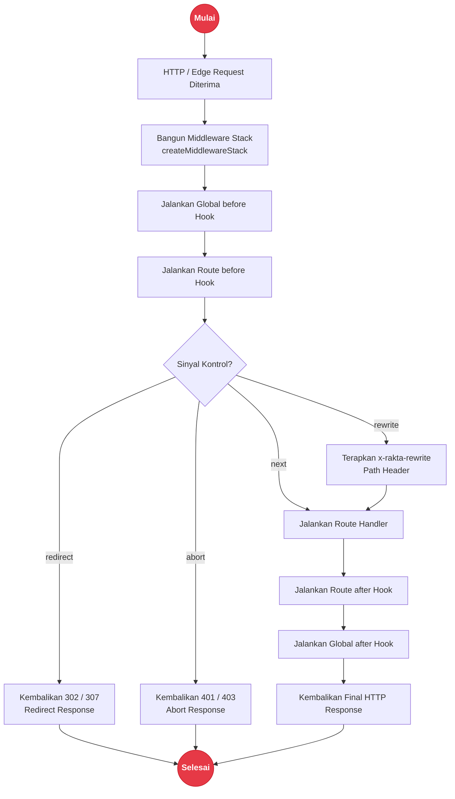

# Middleware Subsystem

Middleware Rakta.js adalah pipeline request async untuk scope global, route, nested, layout, API, dan edge. Middleware diekspor dari `rakta/middleware`.

---

## Alur Eksekusi Middleware Pipeline



---

## Mulai Cepat

```ts
import { before, createMiddlewareStack, redirect } from "rakta/middleware";

const stack = createMiddlewareStack([
  before((context) => {
    const isPrivateRoute = context.pathname.startsWith("/dashboard");
    const hasSession = context.request.headers.get("cookie")?.includes("rakta_session=");

    if (isPrivateRoute && !hasSession) {
      return redirect("/login");
    }
  }),
]);

const response = await stack.handle(request, () => new Response("OK"));
```

---

## Referensi API

| API | Deskripsi |
| --- | --- |
| `createMiddlewareStack(middlewares)` | Membuat pipeline async yang berurutan |
| `defineMiddleware(fn)` | Memberikan bentuk type-safe untuk fungsi middleware |
| `before(fn)` | Menjalankan logic sebelum handler berikutnya |
| `after(fn)` | Menjalankan logic setelah response downstream selesai |
| `redirect(url, status)` | Mengembalikan redirect response |
| `rewrite(pathname)` | Mengembalikan instruksi rewrite dengan `x-rakta-rewrite` |
| `abort(status, body)` | Menghentikan request dengan response |

---

## Dokumen Terkait

- [`kernel.md`](./kernel.md)
- [`templates.md`](./templates.md)
- [`routing.md`](./routing.md)
