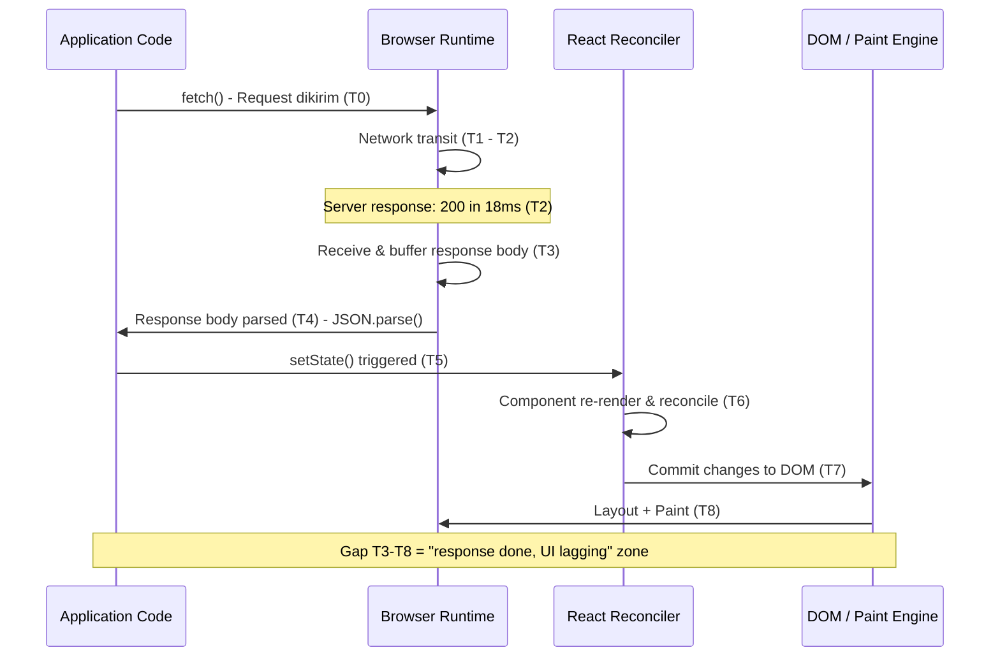
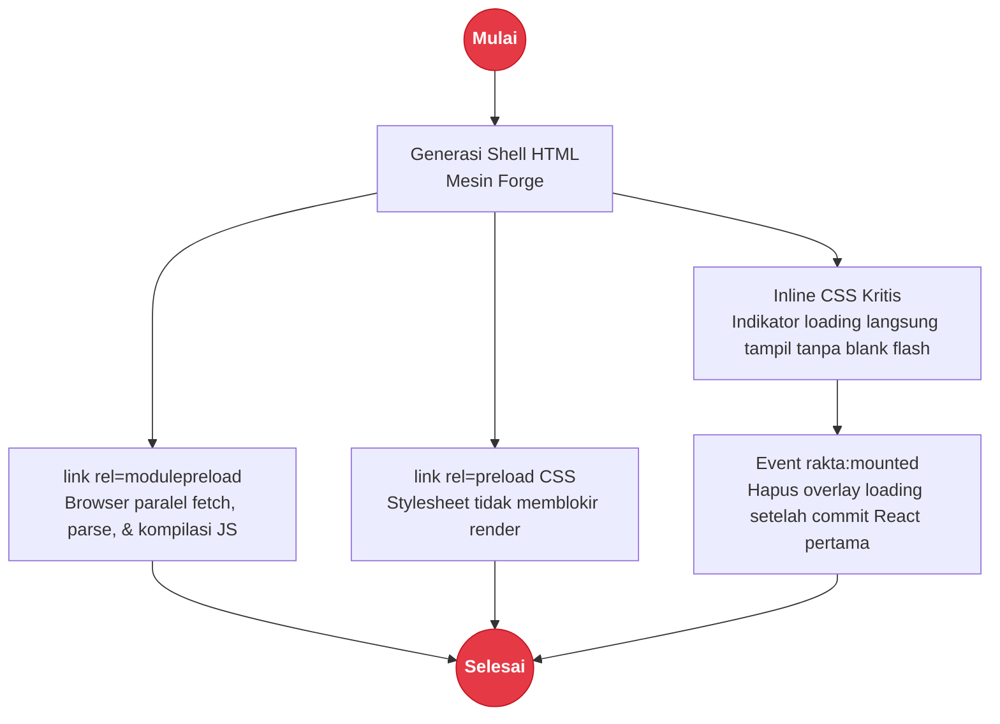

# Performance

## Browser Render Pipeline Breakdown

Penyebab paling umum keluhan "server sudah 200 tapi UI lambat" adalah bottleneck di **browser pipeline**, bukan di server.



---

## Titik Bottleneck Umum

| Tahap | Penyebab | Solusi |
|---|---|---|
| T3 ke T4 | Payload JSON besar (>1MB) | Paginasi, filter di server |
| T4 ke T5 | Transform/sort mahal di client | Pindah ke server, gunakan memoize |
| T5 ke T6 | State update memicu render seluruh tree | `useMemo`, pisah context |
| T6 ke T7 | Component tree besar, tanpa virtualisasi | Virtualisasi list panjang |
| T7 ke T8 | Layout/paint berat (DOM besar, shadow) | Kurangi ukuran DOM |

---

## Pipeline Optimasi HTML Shell



---

## Diagnosis dengan Rakta Dev Indicator

Buka panel Performance di Dev Indicator (logo kiri bawah). Panel menampilkan:

```
Network      18ms    <- sesuai terminal
Parse         3ms
State         2ms
Render       21ms
Paint         4ms
Total        48ms
```

Jika `Response -> UI gap` di Diagnostics menunjukkan >1 detik, periksa baris **State** dan **Render**.

---

## Aplikasi Laporan/Tabel Besar

**Sisi server:**
```ts
// Selalu paginasi di level API
const { data, total } = await db.query({
  limit: req.query.limit ?? 50,
  offset: req.query.offset ?? 0,
});
```

**Sisi client:**
```ts
// useRaktaData dengan loading state
const { data, loading, error, refetch } = useRaktaData(
  (signal) => fetch("/api/laporan?page=1&limit=50", { signal }).then(r => r.json()),
  [],
  "laporan-page-1"
);
```

**Hindari merender lebih dari 500 DOM row sekaligus.** Gunakan windowing/virtualisasi untuk tabel besar.

---

## HTTP Client Performance

Peningkatan `PanturaFetch` (v1.0.7+):

- **Default timeout**: 10 detik (sebelumnya 30 detik) - API lambat terdeteksi lebih cepat
- **keepalive: true** - reuse koneksi TCP, eliminasi overhead handshake pada request sekuensial ke host yang sama
- **Dukungan retry**: `{ retries: 2 }` untuk network error sementara

```ts
const http = createRaktaHttp({
  baseUrl: "http://localhost:4000",
  timeout: 5_000,
});

// Dengan retry
const data = await http.get<Laporan>("/api/laporan", { retries: 2 });
```

---

## Middleware Timing

`createMiddlewareStack` kini melacak elapsed time per-middleware. Total waktu middleware dilampirkan sebagai header `X-Rakta-Middleware-Ms` pada response di development untuk diagnostik.

---

## Benchmark Performance

Semua pengukuran dari development lokal di Windows 11, Bun 1.3.11, React 19.

| Metrik | Sebelum v1.0.7 | v1.0.7 |
|---|---|---|
| Time to first byte (dev) | ~50ms | ~50ms |
| Penemuan JS bundle | Setelah parse HTML | Saat parse HTML (modulepreload) |
| Default timeout HTTP client | 30 000ms | 10 000ms |
| TCP keepalive | Tidak | Ya |
| Loading overlay | Tidak ada | Langsung via inline CSS |

> Benchmark ini dari environment development. Performance production bergantung pada deployment target, spesifikasi server, dan kode aplikasi.
