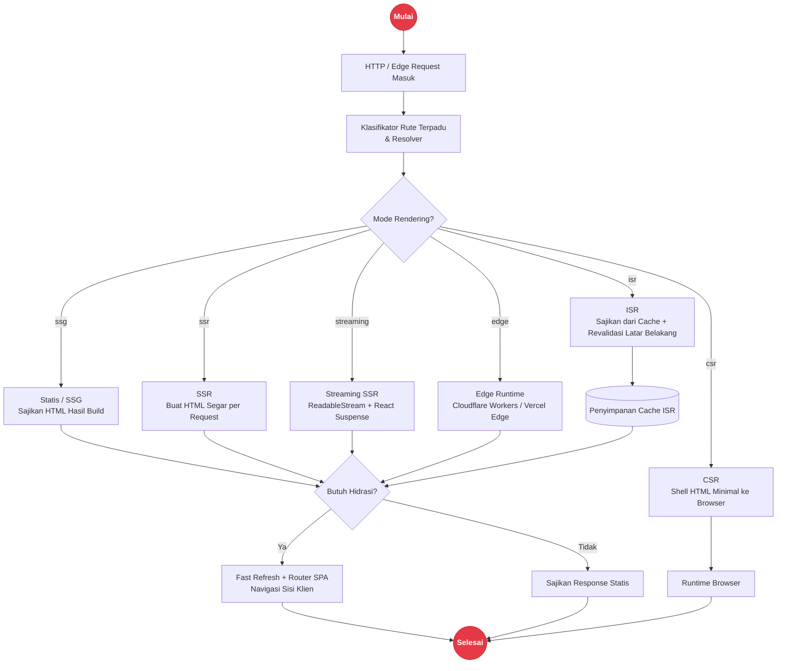

# Arsitektur Unified Rendering & Developer Experience (Fast Refresh / HMR) di Rakta.js

Rakta.js mengadopsi **Unified Rendering Engine (Mesin Rendering Terpadu)** seperti Next.js App Router. Alih-alih memisah-misahkan strategi rendering menjadi silo yang terisolasi, Rakta.js menggabungkan Server Components, SSR, SSG, ISR, Streaming SSR, Edge Runtime, CSR, dan Hybrid Rendering ke dalam **satu pipeline terpadu yang seamless**.

---

## Fast Refresh vs. Hot Module Replacement (HMR)

Rakta.js menyertakan mesin Developer Experience (DX) tingkat lanjut yang memberikan feedback instan saat Anda mengedit kode.

### 1. Fast Refresh (Penjelasan Terperinci)
**Fast Refresh** adalah fitur bawaan Rakta.js yang secara otomatis memperbarui komponen React di browser setiap kali Anda menyimpan (*save*) file kode, **tanpa menghilangkan status (*state*) komponen yang sedang berjalan**.

- **Preservasi State**: Input form yang sedang diisi, posisi scroll, state accordion/modal, dan local state React (`useState`, `useReducer`) **tetap bertahan** dan tidak tertimpa saat file disimpan.
- **Eksekusi Aman**: Jika Anda membuat kesalahan sintaksis atau error runtime saat pengkodean, Rakta Error Overlay akan muncul. Setelah Anda memperbaikinya dan menyimpan file, error overlay langsung tertutup otomatis dan state komponen pulih kembali.
- **Granular Component Updates**: Hanya komponen yang diubah yang di-render ulang (*re-evaluated*), bukan seluruh pohon aplikasi (*application tree*).

### 2. Hot Module Replacement (HMR)
**Hot Module Replacement (HMR)** adalah teknologi dasar di balik layar yang berjalan di atas WebSocket server dev Rakta.js (Forge Dev Server). HMR bertugas menukar (*swap*) modul JavaScript, CSS, atau aset secara langsung di memori browser tanpa melakukan reload halaman penuh (*full page reload*).

#### Perbandingan Singkat:

| Fitur | Fast Refresh | Hot Module Replacement (HMR) |
| :--- | :--- | :--- |
| **Level** | Sisi Aplikasi / Komponen React | Sisi Bundler & Transport Layer (WebSocket) |
| **Fokus Utama** | Menjaga state komponen React saat file disimpan | Menukar modul JS/CSS yang diperbarui secara langsung |
| **Perilaku UI** | Komponen ter-update secara instan tanpa reset form/scroll | Modul diperbarui tanpa trigger `window.location.reload()` |
| **Integrasi** | Terintegrasi dengan React Refresh Runtime & Rakta Shell | Menggunakan WebSocket channel `/__livereload` |

---

## Unified Rendering Engine (Mesin Rendering Terpadu)

Dalam Rakta.js, Anda tidak perlu membuat project terpisah untuk SSG, SSR, atau Client SPA. Mesin rendering Rakta.js mengevaluasi rute aplikasi secara otomatis berdasarkan konfigurasi global dan file export rute.



---

## 8 Mode Rendering dalam Pipeline Terpadu

### 1. Server-Side Rendering (SSR)
Setiap permintaan HTTP memicu generasi HTML segar secara langsung di server. Cocok untuk halaman dinamis yang memerlukan data *real-time* dan SEO tingkat tinggi.

```tsx
// app/dashboard/page.tsx
export const mode = "ssr";

export default async function DashboardPage() {
  const data = await fetch("https://api.example.com/stats", { cache: "no-store" }).then(res => res.json());
  
  return (
    <main>
      <h1>Dashboard Real-time</h1>
      <pre>{JSON.stringify(data, null, 2)}</pre>
    </main>
  );
}
```

### 2. Static Site Generation (SSG)
Halaman dipra-kompilasi (*pre-rendered*) menjadi file HTML statis murni pada saat build (`rakta build`). Memberikan waktu muat tercepat (*sub-millisecond TTFB*) melalui CDN.

```tsx
// app/about/page.tsx
export const mode = "ssg";

export default function AboutPage() {
  return (
    <main>
      <h1>Tentang Rakta.js</h1>
      <p>Kencang. Ringan. Tanpa Overhead.</p>
    </main>
  );
}
```

### 3. Incremental Static Regeneration (ISR)
Menggabungkan kecepatan SSG dengan fleksibilitas SSR. Halaman disajikan sebagai HTML statis dari cache, dan diperbarui secara latar belakang (*background revalidation*) setelah selang waktu tertentu.

```tsx
// app/blog/[slug]/page.tsx
export const mode = "isr";
export const revalidate = 60; // Revalidasi latar belakang setiap 60 detik

export default function BlogPost({ params }: { params: { slug: string } }) {
  return (
    <article>
      <h1>Blog Post: {params.slug}</h1>
    </article>
  );
}
```

### 4. Streaming SSR (HTML ReadableStream)
Mengirimkan shell HTML awal secara instan ke browser dan mengalirkan (*stream*) bagian UI yang membutuhkan waktu loading data lama menggunakan `ReadableStream` dan `React Suspense`.

```tsx
// app/feed/page.tsx
import { Suspense } from "react";

export const mode = "streaming";

async function HeavyFeed() {
  const feed = await fetchHeavyFeedData();
  return <div>{feed.items.map(item => <p key={item.id}>{item.title}</p>)}</div>;
}

export default function FeedPage() {
  return (
    <main>
      <h1>Feed Utama</h1>
      <Suspense fallback={<div>Memuat Feed...</div>}>
        <HeavyFeed />
      </Suspense>
    </main>
  );
}
```

### 5. Edge Runtime Rendering
Menjalankan logika rendering langsung di node jaringan Edge terdekat dari pengguna (Cloudflare Workers, Vercel Edge, Deno Deploy) untuk latensi mendekati 0ms.

```tsx
// app/geo/page.tsx
export const mode = "edge";
export const runtime = "edge";

export default function GeoPage({ requestHeaders }: { requestHeaders: Record<string, string> }) {
  const country = requestHeaders["cf-ipcountry"] || "ID";
  return <div>Lokasi Anda: {country}</div>;
}
```

### 6. Client-Side Rendering (CSR)
Rendering murni di sisi browser. Server hanya mengirimkan shell HTML minimal, dan JavaScript mengonstruksi UI sepenuhnya di klien.

### 7. Single Page Application (SPA Mode)
Navigasi rute sepenuhnya ditangani di sisi klien tanpa reload halaman penuh. Dilengkapi *route prefetching*, *scroll restoration*, dan *lazy loading* komponen rute.

### 8. Hybrid Rendering (Rakta Default)
Menggabungkan berbagai strategi rendering dalam satu aplikasi yang sama. Halaman publik menggunakan SSG/ISR, rute autentikasi menggunakan SSR/Edge, dan dashboard interaktif menggunakan SPA/CSR.

---

## Konfigurasi Global & Route-Level Overrides

Anda dapat menentukan mode rendering default di file `rakta.config.ts`, dan menimpanya (*override*) secara fleksibel di tingkat rute individual.

### `rakta.config.ts` (Global Default)
```ts
import { defineConfig } from "raktajs/config";

export default defineConfig({
  renderMode: "hybrid", // Default global rendering mode
  seo: {
    title: "Aplikasi Rakta.js",
    description: "Aplikasi fullstack berkinerja tinggi dengan Unified Rendering Engine.",
  },
  server: {
    port: 3000,
    host: "localhost",
  },
});
```

### `app/layout.tsx` (Root Layout & Global Metadata)
```tsx
import type { Metadata } from "raktajs";

export const metadata: Metadata = {
  title: "Rakta.js App",
  description: "Ditenagai oleh Unified Rendering & Fast Refresh Engine",
};

export default function RootLayout({ children }: { children: React.ReactNode }) {
  return (
    <html lang="id">
      <body>
        <nav>
          <a href="/">Home</a> | <a href="/dashboard">Dashboard</a>
        </nav>
        {children}
      </body>
    </html>
  );
}
```
