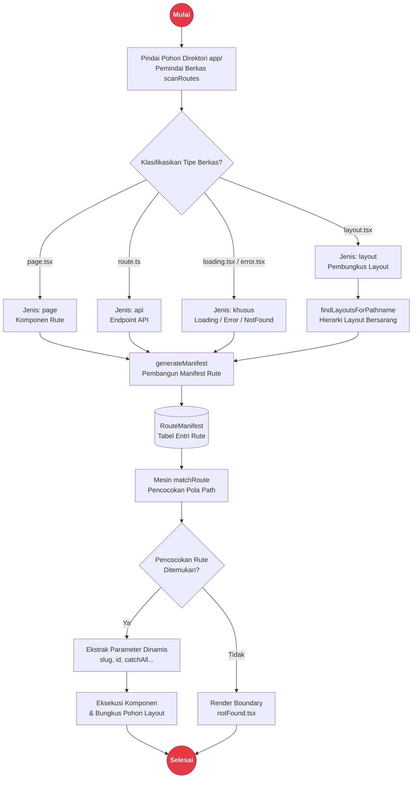

# Routing - MendungWeave

**MendungWeave** adalah layer routing berbasis file di Rakta.js. Struktur folder di bawah `app/` itulah router-nya - tidak ada file konfigurasi route terpusat yang harus dijaga sinkron.

---

## Arsitektur Resolusi Rute (Routing Lifecycle)



---

## Konvensi File

| File | Menjadi |
| --- | --- |
| `app/page.tsx` | `/` |
| `app/about/page.tsx` | `/about` |
| `app/blog/[slug]/page.tsx` | `/blog/:slug` (segmen dinamis) |
| `app/blog/[...slug]/page.tsx` | `/blog/*` (catch-all) |
| `app/(auth)/login/page.tsx` | `/login` - segmen `(auth)` adalah route group dan tidak muncul di URL |
| `app/layout.tsx` | Layout yang membungkus semua route di bawahnya |
| `app/loading.tsx` | Ditampilkan saat segmen route sedang loading |
| `app/error.tsx` | Error boundary untuk segmen route |
| `app/notFound.tsx` | Dirender kalau tidak ada route yang cocok |
| `app/api/users/route.ts` | Endpoint API di `/api/users` |

---

## Contoh Kode

```tsx
// app/blog/[slug]/page.tsx
interface BlogPostPageProps {
  params: { slug: string };
}

export default function BlogPostPage({ params }: BlogPostPageProps) {
  return <h1>Post: {params.slug}</h1>;
}
```

```ts
// app/api/users/route.ts
export async function GET(): Promise<Response> {
  return Response.json({ users: [] });
}

export async function POST(request: Request): Promise<Response> {
  const body = await request.json();
  return Response.json({ created: body }, { status: 201 });
}
```

---

## Route Group untuk Isolasi Layout

Bungkus nama folder dengan tanda kurung untuk mengelompokkan route di bawah layout bersama tanpa menambah segmen URL:

```txt
app/
├─ (auth)/
│  ├─ layout.tsx        hanya membungkus login/register/dll
│  ├─ login/page.tsx     /login
│  └─ register/page.tsx  /register
├─ dashboard/
│  ├─ layout.tsx        sidebar dashboard
│  └─ page.tsx           /dashboard
└─ layout.tsx            layout marketing publik
```

---

## Dokumen Terkait

- [`templates.md`](./templates.md) - bagaimana routing disusun di aplikasi yang di-generate
- [`seo.md`](./seo.md) - metadata per-route
- [`rpc.md`](./rpc.md) - RPC type-safe