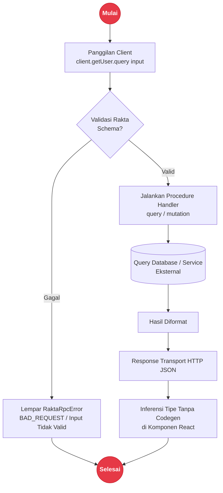

# RPC - CarubanWire

**CarubanWire** adalah layer RPC type-safe di Rakta.js, terinspirasi dari tRPC tapi diimplementasikan secara native untuk Rakta.js tanpa bergantung padanya. Kalian mendefinisikan procedure sekali di server; client mendapat inferensi tipe penuh tanpa proses code generation.

---

## Arsitektur Panggilan RPC & Inferensi Tipe



---

## Ringkasan Komponen

- **Router**: Object biasa yang nilainya adalah procedure yang dibuat dengan `publicProcedure`.
- **Procedure**: Dibangun secara fluent: `.input(schema)` melekatkan validator Rakta Schema yang opsional, lalu `.query(handler)` atau `.mutation(handler)` menyelesaikannya.
- **Client**: Dibuat dengan `createRaktaClient<AppRouter>()`, memanggil `client.namaProcedure.query(input)` mengirim request yang typed dan mengembalikan response yang typed, sepenuhnya diinferensi dari tipe router server.
- **Error**: Error muncul sebagai `RaktaRpcError`, membawa `code` dan `details` opsional untuk kegagalan validasi.

---

## Contoh Kode

### Server Definition
```ts
// backend/src/rpc/router.ts
import { publicProcedure } from "rakta/rpc";
import { object, string } from "rakta/schema";

export const appRouter = {
  greet: publicProcedure
    .input(object({ name: string().min(1) }))
    .query(async ({ input }) => ({ message: `Halo, ${input.name}!` })),
};

export type AppRouter = typeof appRouter;
```

### Client Call
```ts
// frontend/lib/rpc.ts
import { createRaktaClient } from "rakta/rpc";
import type { AppRouter } from "../../backend/src/rpc/router";

export const rpc = createRaktaClient<AppRouter>({
  baseUrl: "http://localhost:4000/rpc",
});

const result = await rpc.greet.query({ name: "Rakta" });
// result.message: string - sudah typed, tanpa anotasi manual
```

---

## Dokumen Terkait

- [`http.md`](./http.md) - PanturaFetch, untuk panggilan HTTP non-RPC
- [`backendFramework.md`](./backendFramework.md) - menghubungkan CarubanWire ke backend