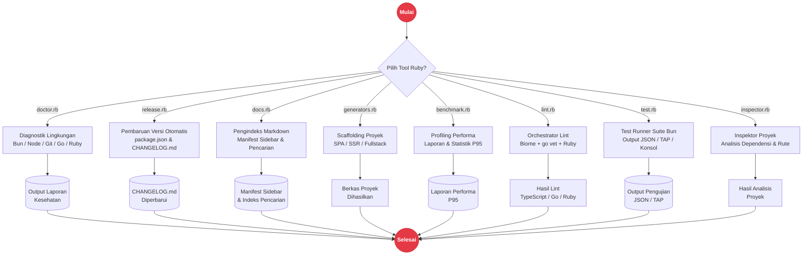

# Utilitas Ekosistem Ruby di Rakta.js

Rakta.js menyertakan utilitas ekosistem Ruby untuk diagnostik lingkungan, rilis versi otomatis, pengindeksan dokumentasi, linter orchestrator, benchmark suite, test runner, dan generator proyek.

---

## Arsitektur Tooling Ruby



---

## Ringkasan Utilitas

1. **`doctor.rb`**: Pemeriksa diagnostik lingkungan runtime Bun, Node, Git, Go, dan Ruby.
2. **`release.rb`**: Pembaru versi otomatis monorepo dan pembuat catatan CHANGELOG.md.
3. **`docs.rb`**: Parser navigasi markdown dan pengindeks manifest sidebar dokumentasi.
4. **`generators.rb`**: Engine generator scaffolding untuk rute SPA, SSR, SSG, CSR, Dashboard, dan Landing Page.
5. **`benchmark.rb`**: Suite pengujian performa untuk startup time, bundling timing, dan statistik file monorepo.
6. **`lint.rb`**: Orchestrator linter lintas bahasa yang mengoordinasikan Biome (TS), `gofmt` & `go vet` (Go), serta sintaks Ruby.
7. **`test.rb`**: Test runner suite otomatis dengan dukungan format laporan JSON, TAP, dan konsol.

---

## Eksekusi Script

```bash
ruby tools/ruby/doctor.rb
ruby tools/ruby/lint.rb
ruby tools/ruby/benchmark.rb --suite=full
ruby tools/ruby/test.rb --reporter=json
```
