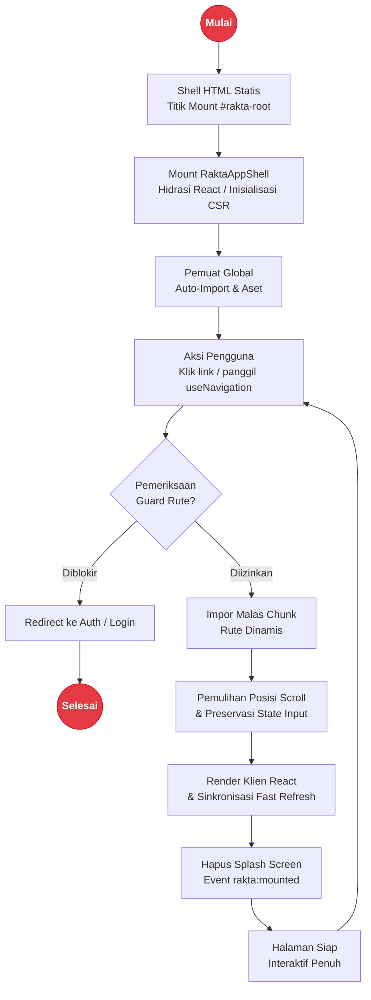

# Mode Single Page Application (SPA) di Rakta.js

Single Page Application (SPA) adalah mode rendering resmi tingkat pertama (first-class) di Rakta.js.

---

## Arsitektur Lifecycle SPA & Navigasi Klien



---

## Fitur Utama Mode SPA

- Navigasi instan client-side menggunakan `<click to="...">` atau `useNavigation()`
- Code splitting otomatis dan route lazy loading
- Pemulihan posisi Scroll bawaan (`<ScrollRestoration />`)
- Proteksi Halaman & Route Guards (`useRouteGuard()`)
- Penanganan Error SPA (`<SpaErrorBoundary />`)

---

## Mengaktifkan Mode SPA

Di `rakta.config.ts`:

```ts
import { defineConfig } from "raktajs/config";

export default defineConfig({
  mode: "spa",
  spa: true,
  autoImport: {
    enabled: true,
  },
});
```

Flag CLI:

```bash
rakta create aplikasi-saya --spa
```

---

## Contoh Proteksi Rute (Route Guard)

```tsx
import { useRouteGuard } from "raktajs/spa";

export default function DashboardTerproteksi() {
  useRouteGuard(({ pathname }) => {
    const terautentikasi = Boolean(localStorage.getItem("token"));
    if (!terautentikasi) {
      return "/login";
    }
    return true;
  });

  return <div>Selamat Datang di Cockpit Terproteksi</div>;
}
```
