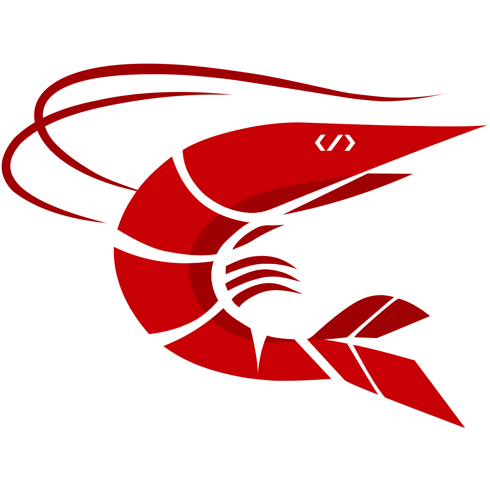

<p align="center">
  <a href="https://raktajs.dev" target="blank"></a>
</p>

<p align="center">A progressive <a href="https://react.dev" target="_blank">React</a> + <a href="https://bun.sh" target="_blank">Bun</a> framework for building efficient and scalable web applications.</p>
<p align="center">
<a href="https://www.npmjs.com/package/raktajs" target="_blank"></a>
<a href="https://www.npmjs.com/package/raktajs" target="_blank"></a>
<a href="https://www.npmjs.com/package/raktajs" target="_blank"></a>
<a href="https://github.com/RheinSullivan/raktajs" target="_blank"></a>
<a href="https://discord.com" target="_blank"></a>
<a href="https://buymeacoffee.com/rheinsullivan" target="_blank"></a>
</p>

## Description

[Rakta.js](https://raktajs.dev) framework TypeScript starter repository. Small in size. Fierce in speed. Alive in every route.

## Project setup

```bash
$ bun install
```

> Dependencies are installed automatically during project creation. If you created the project with `--no-install`, run `bun install` once before starting development.

## Compile and run the project

```bash
# development
$ bun run dev

# watch mode
$ bun run dev

# production mode
$ bun run start
```

## Run tests

```bash
# unit tests
$ bun test

# e2e tests
$ bun test:e2e

# test coverage
$ bun test --coverage
```

## Deployment

When you're ready to deploy your Rakta.js application to production, there are some key steps you can take to ensure it runs as efficiently as possible. Check out the [deployment documentation](https://raktajs.dev/docs/deployment) for more information.

If you are looking for a cloud-based platform to deploy your Rakta.js application, check out [Rakta Edge](https://raktajs.dev), our official deployment platform for deploying Rakta.js applications to serverless and edge nodes.

## Resources

Check out a few resources that may come in handy when working with Rakta.js:

- Visit the [Rakta.js Documentation](https://raktajs.dev) to learn more about the framework.
- For questions and support, please visit our [Discord channel](https://discord.com).
- To dive deeper and get more hands-on experience, check out our [Showcase](https://raktajs.dev#showcase).
- Deploy your application to Edge with the help of [Rakta CLI](https://raktajs.dev) in just a few clicks.
- Need help with your project (part-time to full-time)? Check out our official [enterprise support](https://github.com/sponsors/RheinSullivan).
- 🇵🇸 **Free Palestine** - Minimum 70% of public donations are allocated directly to emergency medical relief in Palestine.

## Support

Rakta is an MIT-licensed open source project. It can grow thanks to the sponsors and support by the amazing backers. If you'd like to join them, please [read more here](https://buymeacoffee.com/rheinsullivan).

## Stay in touch

- Author - [Muhammad Rizky Ramadhan (Rhein Sullivan)](https://github.com/RheinSullivan)
- Website - [https://raktajs.dev](https://raktajs.dev)
- Twitter - [@RheinSullivan](https://twitter.com/RheinSullivan)

## License

Rakta is [MIT licensed](LICENCE).
